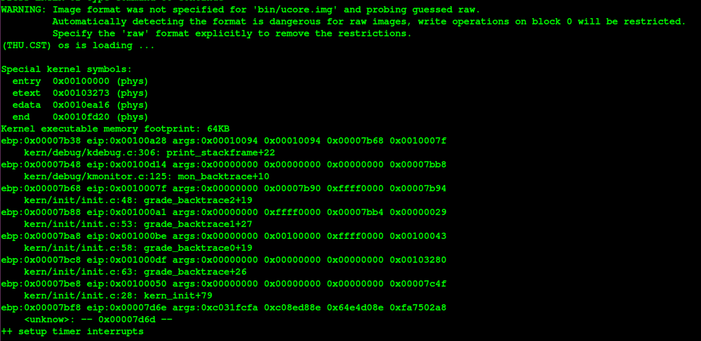

# Operating Systems Lab 1 系统软件启动过程 实验报告
		

## 基本练习

### 练习1： 理解通过make生成执行文件的过程

#### 1.1 操作系统镜像文件ucore.img是如何一步一步生成的？(需要比较详细地解释Makefile中每 一条相关命令和命令参数的含义，以及说明命令导致的结果)
不妨对整个lab1所提供的Makefile进行解释如下：

- 不妨首先考虑Makefile中生成ucore.img相关的主要代码(暂时不考虑细节问题)来描述生成出ucore.img的每一个具体步骤:
  - 生成kernel: 
    - 首先是`$(call add_files_cc,$(call listf_cc,$(LIBDIR)),libs,)`这一段代码，含义是寻找libs目录下的所有具有.c, .s后缀的文件，并生成相应的.o文件，放置在obj/libs/文件夹下，具体生成的文件是printfmt.o, string.o文件，与此同时，该文件夹下还生成了.d文件，这是Makefile自动生成的依赖文件列表所存放的位置，比如打开string.d文件可以发现，string.o文件的生成依赖于string.c, string.h, x86.h, defs.h四个文件，这与我们对于代码的观察是一致的；这部分编译所使用的编译选项保存在CFLAGS变量下，关于具体每一个使用到的gcc编译选项的含义，将在下文具体分析Makefile中定义CFLAGS变量的部分进行详细描述；
    - `$(call add_files_cc,$(call listf_cc,$(KSRCDIR)),kernel,$(KCFLAGS)`这一段代码将用于生成kernel的所有子目录下包含的CTYPE文件（.s, .c文件）所对应的.o文件以及.d文件，这段代码与上述生成obj/libs/\*.o文件的代码类似，区别仅在于其还新指定了若干gcc编译选项，存放在KCFLAGS变量中，具体为制定了若干存放在KINCLUDE变量下的头文件；具体而言，该命令最终生成的文件为obj/kern下子目录里的以stdio, readline, panic, kdebug, kmonitor, clock, console, picirq, intr, trap, vector, trapentry, pmm为前缀的.d, .o文件；
    - 接下来`$(kernel): tools/kernel.ld`表示/bin/kernel文件依赖于tools/kernel.ld文件，并且没有指定生成规则，也就是说如果没有预先准备好kernel.ld，就会在make的时候产生错误；之后的`$(kernel): $(KOBJS)`表示kernel文件的生成还依赖于上述生成的obj/libs, obj/kernels下的.o文件，并且生成规则为使用ld链接器将这些.o文件连接成kernel文件，其中ld的-T表示指定使用kernel.ld来替代默认的链接器脚本；关于LDFLAGS中的选项含义，将在下文中描述LDFLAGS变量定义的时候进行描述；之后还使用objdump反汇编出kernel的汇编代码，-S表示将源代码与汇编代码混合展示出来，这部分代码最终保存在kernel.asm文件中；-t表示打印出文件的符号表表项，然后通过管道将带有符号表的反汇编结果作为sed命令的标准输入进行处理，最终将符号表信息保存到kernel.sym文件中；
  - 生成bootblock文件：
    - 首先是`$(foreach f,$(bootfiles),$(call cc_compile,$(f),$(CC),$(CFLAGS) -Os -nostdinc)`这一段代码，表示将boot/文件夹下的bootasm.S, bootmain.c两个文件编译成相应的.o文件，并且生成依赖文件.d；其中涉及到的两个gcc编译选项含义如下所示：
      - -nostdinc: 不搜索默认路径头文件；
      - -0s: 针对生成代码的大小进行优化，这是因为bootloader的总大小被限制为不大于512-2=510字节；
    - 接下来由代码`$(bootblock): $(call toobj,$(bootfiles)) | $(call totarget,sign`可知，bootblock依赖于bootasm.o, bootmain.o文件与sign文件，其中两个.o文件由以下规则生成：
    	- `$(V)$(LD) $(LDFLAGS) -N -e start -Ttext 0x7C00 $^ -o $(call toobj,bootblock)`: 使用ld链接器将依赖的.o文件链接成bootblock.o文件，该文件中除了$(LDFLAGS)之外的其他选项含义如下：
          - -N：将代码段和数据段设置为可读可写；
          - -e：设置入口；
          - -Ttext：设置起始地址为0X7C00；
    - `@$(OBJDUMP) -S $(call objfile,bootblock) > $(call asmfile,bootblock)`: 使用objdump将编译结果反汇编出来，保存在bootclock.asm中，-S表示将源代码与汇编代码混合表示；
    - `@$(OBJCOPY) -S -O binary $(call objfile,bootblock) $(call outfile,bootblock)`: 使用objcopy将bootblock.o二进制拷贝到bootblock.out，其中：
    - -S：表示移除符号和重定位信息；
    - -O：表示指定输出格式；
    - `@$(call totarget,sign) $(call outfile,bootblock) $(bootblock)`: 使用sign程序, 利用bootblock.out生成bootblock;
    - `$(call add_files_host,tools/sign.c,sign,sign`: 利用tools/sing.c生成sign.o, `$(call create_target_host,sign,sign)`则利用sign.o生成sign，至此bootblock所依赖的文件均生成完毕；
  - 最后一个部分是利用dd命令使用bootblock, kernel文件来生成ucore.img文件：
    - `$(V)dd if=/dev/zero of=$@ count=10000` 命令表示从/dev/zero文件中获取10000个block，每一个block为512字节，并且均为空字符，并且输出到目标文件ucore.img中；
    - `$(V)dd if=$(bootblock) of=$@ conv=notrunc` 命令表示从bootblock文件中获取数据，并且输出到目标文件ucore.img中，-notruct选项表示不要对数据进行删减；
    - `$(V)dd if=$(kernel) of=$@ seek=1 conv=notrunc` 命令表示从kernel文件中获取数据，并且输出到目标文件ucore.img中, 并且seek = 1表示跳过第一个block，输出到第二个块；

- 至此，关于生成ucore.img文件的主要的Makefile命令分析完成；
    
- 接下来将就整个Makefile文件中的其他每个部分进行分析:首先在Makefile的最开始是对各种常量的初始化：

```
PROJ	:= challenge
EMPTY	:=
SPACE	:= $(EMPTY) $(EMPTY)
SLASH	:= /

V       :=
```

- 接下来部分则用于推断环境中调用所安装的gcc应当使用的命令：
  在本部分，如果为定义GCCPREFIX变量，则利用了linux bash中的技巧来推断所使用的gcc命令是什么, 在本部分首先猜测gcc命令的前缀是i386-elf-，因此执行i386-elf-objdump -i命令，2>&1表示将错误输出一起输出到标准输出里，然后通过管道的方式传递给下一条bash命令grep '^elf32-i386$$' >/dev/null 2>&1;，>/dev/null这部分表示将标准输出输出到一个空设备里，而输入上一条命令发送给grep的标准输出（作为grep的输入）中可以匹配到'^elf32-i386$$'的话，则说明i386-elf-objdump这一命令是存在的，那么条件满足，由echo输出'i386-elf-'，由于是在$()里的bash命令，这个输出会作为值被赋给GCCPREFIX变量；如果i386-elf-objdump命令不存在，则猜测使用的gcc命令不包含其他前缀，则继续按照上述方法，测试objdump这条命令是否存在，如果存在则GCCPREFIX为空串，否则之间报错，要求显示地提供gcc的前缀作为GCCPREFIX变量的数值（可以在环境变量中指定）；
```
ifndef GCCPREFIX
GCCPREFIX := $(shell if i386-elf-objdump -i 2>&1 | grep '^elf32-i386$$' >/dev/null 2>&1; \
	then echo 'i386-elf-'; \
	elif objdump -i 2>&1 | grep 'elf32-i386' >/dev/null 2>&1; \
	then echo ''; \
	else echo "***" 1>&2; \
	echo "*** Error: Couldn't find an i386-elf version of GCC/binutils." 1>&2; \
	echo "*** Is the directory with i386-elf-gcc in your PATH?" 1>&2; \
	echo "*** If your i386-elf toolchain is installed with a command" 1>&2; \
	echo "*** prefix other than 'i386-elf-', set your GCCPREFIX" 1>&2; \
	echo "*** environment variable to that prefix and run 'make' again." 1>&2; \
	echo "*** To turn off this error, run 'gmake GCCPREFIX= ...'." 1>&2; \
	echo "***" 1>&2; exit 1; fi)
endi
```

- 接下来部分与上述方法一致，利用bash命令来推断qemu的命令，因此具体细节不再赘述；
```
# try to infer the correct QEMU
ifndef QEMU
QEMU := $(shell if which qemu-system-i386 > /dev/null; \
	then echo 'qemu-system-i386'; exit; \
	elif which i386-elf-qemu > /dev/null; \
	then echo 'i386-elf-qemu'; exit; \
	elif which qemu > /dev/null; \
	then echo 'qemu'; exit; \
	else \
	echo "***" 1>&2; \
	echo "*** Error: Couldn't find a working QEMU executable." 1>&2; \
	echo "*** Is the directory containing the qemu binary in your PATH" 1>&2; \
	echo "***" 1>&2; exit 1; fi)
endi
```

- 接下来的部分定义了各种编译命令以及编译选项，其中-fno-stack-protector编译选项的确定也使用了与上文确定GCCPREFIX相似的技巧，巧妙地利用了linux bash中 && 连接起来的两条指令，如果第一条指令出错，则第二条指令不会执行的特点，来确认当前的gcc是否允许使用 -fno-stack-protector这一编译选项；

- 该段Makefile代码中所设计的所有gcc编译选项和链接器ld选项的作用分别如下：
  - -g：在编译中加入调试信息，便于之后使用gdb进行调试；
  - -Wall：使能所有编译警告，便于发现潜在的错误；
  - -O2: 开启O2编译优化；
  - -fno-builtin: 不承认所有不是以__builtin__为开头的内建函数；
  - -ggdb 产生gdb所需要的调试信息（与-g的区别是ggdb的调试信息是专门为gdb而生成的）；
  - -m32: 32位模式；
  - -gstabs：以stabs格式输出调试信息，不包括gdb拓展；
  - -nostdinc: 不搜索默认路径头文件；
  - -fno-stack-protector: 禁用堆栈保护;
  - -nostdlib: 该链接器选项表示不链接任何系统标准启动文件和标准库文件，这是因为编译操作系统内核和bootloader是不需要这些启动文件和库就应该能够执行的；

- 其他涉及到的bash命令选项为：
  - mkdir -p: 允许创建嵌套子目录；
  - touch -c: 不创建已经存在的文件；
  - rm -f: 无视任何确认提示；

```
# eliminate default suffix rules
.SUFFIXES: .c .S .h

# delete target files if there is an error (or make is interrupted)
.DELETE_ON_ERROR:

# define compiler and flags
ifndef  USELLVM
HOSTCC		:= gcc
HOSTCFLAGS	:= -g -Wall -O2
CC		:= $(GCCPREFIX)gcc
CFLAGS	:= -fno-builtin -Wall -ggdb -m32 -gstabs -nostdinc $(DEFS)
CFLAGS	+= $(shell $(CC) -fno-stack-protector -E -x c /dev/null >/dev/null 2>&1 && echo -fno-stack-protector)
else
HOSTCC		:= clang
HOSTCFLAGS	:= -g -Wall -O2
CC		:= clang
CFLAGS	:= -fno-builtin -Wall -g -m32 -mno-sse -nostdinc $(DEFS)
CFLAGS	+= $(shell $(CC) -fno-stack-protector -E -x c /dev/null >/dev/null 2>&1 && echo -fno-stack-protector)
endif

CTYPE	:= c S

LD      := $(GCCPREFIX)ld
LDFLAGS	:= -m $(shell $(LD) -V | grep elf_i386 2>/dev/null)
LDFLAGS	+= -nostdlib

OBJCOPY := $(GCCPREFIX)objcopy
OBJDUMP := $(GCCPREFIX)objdump

COPY	:= cp
MKDIR   := mkdir -p
MV		:= mv
RM		:= rm -f
AWK		:= awk
SED		:= sed
SH		:= sh
TR		:= tr
TOUCH	:= touch -c

OBJDIR	:= obj
BINDIR	:= bin

ALLOBJS	:=
ALLDEPS	:=
TARGETS	:=
```

- 接下来的部分引用了tools/function.mk文件，因此不仿分析该文件的内容如下：

```
# list all files in some directories: (#directories, #types)
listf = $(filter $(if $(2),$(addprefix %.,$(2)),%),\
		  $(wildcard $(addsuffix $(SLASH)*,$(1)))
```

上述定义了一个获取某一个目录下的所有某类型文件的表达式，该表达式可以使用call函数调用来使用，其中$(if $(2),$(addprefix %.,$(2)),%)部分是用于构造一个%.某后缀形式的pattern，$(wildcard $(addsuffix $(SLASH)\*,$(1))部分则是被是用来获取当前目录下的而所有文件，并且使用filter函数过滤出这所有文件中具有.$(2) (即call传入的第二个参数)后缀的文件；

```
# get .o obj files: (#files[, packet])
toobj = $(addprefix $(OBJDIR)$(SLASH)$(if $(2),$(2)$(SLASH)),\
		$(addsuffix .o,$(basename $(1)))
```
该表达式表示将传入的文件名列表中的所有后缀修改为.o，并且将其添加上这些.o文件的目录，获取到这些.o文件最终应该存放的位置；

```
# get .d dependency files: (#files[, packet])
todep = $(patsubst %.o,%.d,$(call toobj,$(1),$(2))
```
将所有.o文件的后缀名修改为.d;

```
totarget = $(addprefix $(BINDIR)$(SLASH),$(1))
```
获取由第一个参数传入的binary文件最终应当存放的位置；

```
# change $(name) to $(OBJPREFIX)$(name): (#names)
packetname = $(if $(1),$(addprefix $(OBJPREFIX),$(1)),$(OBJPREFIX)
```
给第一个参数传入的所有文件名加上$(OBJPREFIX)前缀；

```
# cc compile template, generate rule for dep, obj: (file, cc[, flags, dir])
define cc_template
$$(call todep,$(1),$(4)): $(1) | $$$$(dir $$$$@)
	@$(2) -I$$(dir $(1)) $(3) -MM $$< -MT "$$(patsubst %.d,%.o,$$@) $$@"> $$@
$$(call toobj,$(1),$(4)): $(1) | $$$$(dir $$$$@)
	@echo + cc $$<
	$(V)$(2) -I$$(dir $(1)) $(3) -c $$< -o $$@
ALLOBJS += $$(call toobj,$(1),$(4))
ende
```
这部分使用define多行定义了一个编译的模板(对单个文件进行编译成object文件)，其中若干处$$表示原本的字符$，这是因为后文中将对这个部分执行eval，而$$<即原本的$<表示了依赖目标的值，$@表示了目标的值, 在本部分中，将最终生成出目标文件的依赖文件，以及定义了生成目标文件的规则; 

更具体一点，该模板的前半部分是用于生成Makefile .d依赖文件（利用gcc的-MM选项），后半部分则是使用gcc编译出.o文件, 并且将所有.o文件加入到ALLOBJS变量中；

关于上述代码中的$(V)的使用，经过尝试，发现make "V="会输出gcc命令的编译选项、include目录等部分，恰好对应于上述代码中$(V)后的部分，因此猜测$(V)的使用是为了控制是否输出编译过程中的详细信息；

```
define do_cc_compile
$$(foreach f,$(1),$$(eval $$(call cc_template,$$(f),$(2),$(3),$(4))))
ende
```
表示将传入的文件列表中的每一个文件都使用cc_template进行生成编译模板；

```
# add files to packet: (#files, cc[, flags, packet, dir])
define do_add_files_to_packet
__temp_packet__ := $(call packetname,$(4))
ifeq ($$(origin $$(__temp_packet__)),undefined)
$$(__temp_packet__) :=
endif
__temp_objs__ := $(call toobj,$(1),$(5))
$$(foreach f,$(1),$$(eval $$(call cc_template,$$(f),$(2),$(3),$(5))))
$$(__temp_packet__) += $$(__temp_objs__)
ende
```
上述代码中，首先使用call packetname生成出某一个packetname对应的makefile中变量的名字，然后使用origin查询这个变量是否已经定义过，如果为定义，则初始化该变量为空；之后使用toobj生成出该packet中所需要的生成的.o文件的文件名列表，然后将其添加到以\_\_temp\_packet\_\_这个变量中所存的值作为名字的变量中去，并且使用cc\_template生成出该packet生成.d文件和.o文件的代码；

```
# add objs to packet: (#objs, packet)
define do_add_objs_to_packet
__temp_packet__ := $(call packetname,$(2))
ifeq ($$(origin $$(__temp_packet__)),undefined)
$$(__temp_packet__) :=
endif
$$(__temp_packet__) += $(1)
ende
```
上述代码表示将某一个.o文件添加到某一个packet对应的makefile中的变量中的文件列表中去；举例，如果要添加a.o到pack这一个packet中，则结果就是\_\_objs\_这个变量会执行\_\_objs\_pack += a.o这个一个操作；

```
# add packets and objs to target (target, #packes, #objs[, cc, flags])
define do_create_target
__temp_target__ = $(call totarget,$(1))
__temp_objs__ = $$(foreach p,$(call packetname,$(2)),$$($$(p))) $(3)
TARGETS += $$(__temp_target__)
ifneq ($(4),)
$$(__temp_target__): $$(__temp_objs__) | $$$$(dir $$$$@)
	$(V)$(4) $(5) $$^ -o $$@
else
$$(__temp_target__): $$(__temp_objs__) | $$$$(dir $$$$@)
endif
ende
```
上述代码表示将第一个参数传入的binary targets和第三个参数传入的object文件均添加到TARGETS变量中去，之后根据第4个参数是否传入gcc编译命令来确定是否生成编译的规则；

```
# finish all
define do_finish_all
ALLDEPS = $$(ALLOBJS:.o=.d)
$$(sort $$(dir $$(ALLOBJS)) $(BINDIR)$(SLASH) $(OBJDIR)$(SLASH)):
	@$(MKDIR) $$@
ende
```
创建编译过程中所需要的子目录；

```
# --------------------  function end  --------------------
# compile file: (#files, cc[, flags, dir])
cc_compile = $(eval $(call do_cc_compile,$(1),$(2),$(3),$(4)))

# add files to packet: (#files, cc[, flags, packet, dir])
add_files = $(eval $(call do_add_files_to_packet,$(1),$(2),$(3),$(4),$(5)))

# add objs to packet: (#objs, packet)
add_objs = $(eval $(call do_add_objs_to_packet,$(1),$(2)))

# add packets and objs to target (target, #packes, #objs, cc, [, flags])
create_target = $(eval $(call do_create_target,$(1),$(2),$(3),$(4),$(5)))

read_packet = $(foreach p,$(call packetname,$(1)),$($(p)))

add_dependency = $(eval $(1): $(2))

finish_all = $(eval $(call do_finish_all)
```
接下来这部分则是使用eval来进一步将原先设计好的编译代码的表达式中的变量替换为变量的数值，从而方便后面生成编译的规则，接下来不妨以cc\_compile这个表达式的求值为例，说明Makefile中是如何生成编译规则的：

> 为了方便起见，不妨假设传入cc\_compile这个表达式的四个参数分别为main.c, gcc, -Wall, bin, 则不妨首先计算`$(call do_cc_compile,$(1),$(2),$(3),$(4))`表达式的数值如下：
```
cc_compile 	
=$(eval $(call do_cc_compile,$(1),$(2),$(3),$(4))
=$(eval $$(foreach f,$(1),$$(eval $$(call cc_template,$$(f),$(2),$(3),$(4))))
=$(eval $(foreach f, $(1), $(eval $(call cc_template, $(f), $(2), $(3), $(4)))))
=$(eval $(eval $(call cc_template, $(1), $(2), $(3), $(4)))) (since $(1)=main.c)
=$(eval $(eval 
$$(call todep,$(1),$(4)): $(1) | $$$$(dir $$$$@)
	@$(2) -I$$(dir $(1)) $(3) -MM $$< -MT "$$(patsubst %.d,%.o,$$@) $$@"> $$@
$$(call toobj,$(1),$(4)): $(1) | $$$$(dir $$$$@)
	@echo + cc $$<
	$(V)$(2) -I$$(dir $(1)) $(3) -c $$< -o $$@
ALLOBJS += $$(call toobj,$(1),$(4)
))
= $(eval
$(call todep, $(1), $(4))): $(1) | $$(dir $$@)
	@$(2) -I $(dir $(1))  $(3) -MM $< -MT "$(patsubst %.d,%.o,$@) $@"> $@
$(call toobj,$(1),$(4)): $(1) | $$(dir $$@)
	@echo + cc $<
	$(V)$(2) -I$(dir $(1)) $(3) -c $< -o $@
ALLOBJS += $(call toobj,$(1),$(4))
)
= $(eval
obj/main.d: main.c | $$(dir $$@)
	@gcc -I./ -Wall -MM main.c -MT "main.o main.d"> main.d
obj/main.o: main.c | $$(dir $$@)
	@echo + cc main.c
	$(V)gcc -I./ -Wall -c main.c -o main.o
)
=
obj/main.d: main.c | obj
	@gcc -I./ -Wall -MM main.c -MT "main.o main.d"> main.d 
obj/main.o: main.c | obj
	@echo + cc main.c
	$(V)gcc -I./ -Wall -c main.c -o main.o
```
至此通过例子演示了如果使用Makefile来生成一系列编译规则，如果对Makefile文件稍加修改（删去生成规则前面的@），则可以在make的时候得到具体执行的规则，可以发现生成obj/boot/bootasm.d, obj/boot/bootasm.o的实际执行的命令为`gcc -Iboot/ -fno-builtin -Wall -ggdb -m32 -gstabs -nostdinc  -fno-stack-protector -Ilibs/ -Os -nostdinc -MM boot/bootmain.c -MT "obj/boot/bootmain.o obj/boot/bootmain.d"> obj/boot/bootmain.d`和`gcc -Iboot/ -fno-builtin -Wall -ggdb -m32 -gstabs -nostdinc  -fno-stack-protector -Ilibs/ -Os -nostdinc -c boot/bootasm.S -o obj/boot/bootasm.o`，与上述例子中展开的结果进行对比，可以确认该分析过程的正确性；

- 其余Makefile命令均用于生成phony目标来完成clean，grade等一系列功能，与具体生成ucore.img过程无关，因此在本报告中将不太对其进行分析；

#### 1.2 一个被系统认为是符合规范的硬盘主引导扇区的特征是什么？

该扇区最后两个字节为0X55AA；（bi该扇区有512个字节）

### 练习2：使用qemu执行并调试lab1中的软件

#### 2.1 从CPU加电后执行的第一条指令开始，单步跟踪BIOS的执行。

由于BIOS是在实模式下运行的，因此需要在tools/gdbinit里进行相应设置，将其修改为:
```
set arch i8086
target remote: 1234
```
之后再执行make debug，就可以使用gdb单步追踪BIOS的指令执行了；具体调试结果如下图所示；有图可见在刚初始化的时候，cs，eip寄存器的数值分别被初始化为0xf000, 0xfff0, 即第一个执行的指令位于内存中的0xffff0处，该指令是一条跳转指令，跳转到BIOS的主题代码所在的入口；如图所示，使用GDB进行调试可以很方便地观察指令执行过程中的所有寄存器的数值变化；


#### 2.2 在初始化位置0x7c00设置实地址断点,测试断点正常。

0x7c00是bootloader的入口位置，此时CPU仍然处于实模式下，因此只需要设置实地址断点在0x7c00处即可，此时需要的tools/gdbinit文件如下：
```
set arch i8086
target remote: 1234
b *0x7c00
continue
```

右下图中的cs:ip=0:0x7c00可以知道，此时停止在了0x7c00处，也就是说断点设置正常；


#### 2.3 从0x7c00开始跟踪代码运行,将单步跟踪反汇编得到的代码与bootasm.S和 bootblock.asm进行比较。

根据下图，发现根据实验指导书的提示设置了hook-stop之后，可以看到成功地反汇编了从0x7c00开始的执行的指令的汇编代码，与bootasm.S的入口处的代码进行比较，发现除了gdb反汇编出来的指令中没有指定位宽w（word）之外，其余内容完全一致；

```
// bootasm.S
...
cld
xorw %ax, %ax
movw %ax, %ds
movw %ax, %es
movw %ax, %ss
...
```


#### 2.4 自己找一个bootloader或内核中的代码位置，设置断点并进行测试。

在本次实验中，选择了在内核中设置断点，由于内核是运行在32位保护模式下的，并且运行是需要符号表信息，使得可以在调试过程中得知具体运行的是哪一行C代码，因此对tools/gdbinit做若干修改如下：

```
file bin/kernel
target remote: 1234
b cons_init
continue
```

由下图可以见成功设置了在cons\_init函数处的断点并且对函数进行了调试：


### 练习3：分析bootloader进入保护模式的过程

bootloader中从实模式进到保护模式的代码保存在lab1/boot/bootasm.S文件下，使用x86汇编语言编写，接下来将根据源码分析进入保护模式的过程：

bootloader入口为start, 根据bootloader的相关知识可知，bootloader会被BIOS加载到内存的0x7c00处，此时cs=0, eip=0x7c00，在刚进入bootloader的时候，最先执行的操作分别为关闭中断、清除EFLAGS的DF位以及将ax, ds, es, ss寄存器初始化为0；

```asm
.globl start
start:
.code16                                             # Assemble for 16-bit mode
    cli                                             # Disable interrupts
    cld                                             # String operations increment

    # Set up the important data segment registers (DS, ES, SS).
    xorw %ax, %ax                                   # Segment number zero
    movw %ax, %ds                                   # -> Data Segment
    movw %ax, %es                                   # -> Extra Segment
    movw %ax, %ss                                   # -> Stack Segment
```

接下来为了使得CPU进入保护模式之后能够充分使用32位的寻址能力，需要开启A20，关闭“回卷”机制；该过程主要分为等待8042控制器Inpute Buffer为空，发送P2命令到Input Buffer，等待Input Buffer为空，将P2得到的第二个位（A20选通）置为1，写回Input Buffer；接下来对应上述步骤分析bootasm中的汇编代码：

首先是从0x64内存地址中（映射到8042的status register）中读取8042的状态，直到读取到的该字节第二位（input buffer是否有数据）为0，此时input buffer中无数据；
```asm
seta20.1:
    inb $0x64, %al                                  # Wait for not busy(8042 input buffer empty).
    testb $0x2, %al
    jnz seta20.1

    movb $0xd1, %al                                 # 0xd1 -> port 0x64
    outb %al, $0x64                                 # 0xd1 means: write data to 8042's P2 port
```

接下来往0x64写入0xd1命令，表示修改8042的P2 port；
```asm
movb $0xd1, %al
outb %al, $0x64
```

接下来继续等待input buffer为空：
```asm
seta20.2:
    inb $0x64, %al                                  # Wait for not busy(8042 input buffer empty).
    testb $0x2, %al
    jnz seta20.2

    movb $0xdf, %al                                 # 0xdf -> port 0x60
    outb %al, $0x60                                 # 0xdf = 11011111, means set P2's A20 bit(the 1 bit) to 1
```

接下来往0x60端口写入0xDF，表示将P2 port的第二个位（A20）选通置为1；
```asm
movb $0xdf, %al
outb %al, $0x60
```

至此，A20开启，进入保护模式之后可以充分使用4G的寻址能力；

接下来需要设置GDT（全局描述符表），在bootasm.S中已经静态地描述了一个简单的GDT，如下所示; 值得注意的是GDT中将代码段和数据段的base均设置为了0，而limit设置为了2^32-1即4G，此时就使得逻辑地址等于线性地址，方便后续对于内存的操作；

```asm
# Bootstrap GDT
.p2align 2                                          # force 4 byte alignment
gdt:
    SEG_NULLASM                                     # null seg
    SEG_ASM(STA_X|STA_R, 0x0, 0xffffffff)           # code seg for bootloader and kernel
    SEG_ASM(STA_W, 0x0, 0xffffffff)                 # data seg for bootloader and kernel

gdtdesc:
    .word 0x17                                      # sizeof(gdt) - 1
    .long gdt     
```

因此在完成A20开启之后，只需要使用命令`lgdt gdtdesc`即可载入全局描述符表；接下来只需要将cr0寄存器的PE位置1，即可从实模式切换到保护模式：

```asm
    movl %cr0, %eax
    orl $CR0_PE_ON, %eax
    movl %eax, %cr0
```

接下来则使用一个长跳转指令，将cs修改为32位段寄存器，以及跳转到protcseg这一32位代码入口处，此时CPU进入32位模式：

```asm
    ljmp $PROT_MODE_CSEG, $protcseg
```

接下来执行的32位代码功能为：设置ds、es, fs, gs, ss这几个段寄存器，然后初始化栈的frame pointer和stack pointer，然后调用使用C语言编写的bootmain函数，进行操作系统内核的加载，至此，bootloader已经完成了从实模式进入到保护模式的任务；

### 练习4：分析bootloader加载ELF格式的OS的过程。

- bootloader如何读取硬盘扇区的？

不妨对bootmain.c中与读取磁盘扇区相关的代码进行分析：

首先是waitdisk函数，该函数的作用是连续不断地从0x1F7地址读取磁盘的状态，直到磁盘不忙为止；
```c
static void
waitdisk(void) {
    while ((inb(0x1F7) & 0xC0) != 0x40)
        /* do nothing */;
}
```

接下来是readsect函数，其基本功能为读取一个磁盘扇区，关于具体代码的含义如下代码中注释所示：
```c
static void
readsect(void *dst, uint32_t secno) {
    waitdisk(); // 等待磁盘到不忙为止

    outb(0x1F2, 1);             // 往0X1F2地址中写入要读取的扇区数，由于此处需要读一个扇区，因此参数为1
    outb(0x1F3, secno & 0xFF); // 输入LBA参数的0...7位；
    outb(0x1F4, (secno >> 8) & 0xFF); // 输入LBA参数的8-15位；
    outb(0x1F5, (secno >> 16) & 0xFF); // 输入LBA参数的16-23位；
    outb(0x1F6, ((secno >> 24) & 0xF) | 0xE0); // 输入LBA参数的24-27位（对应到0-3位），第四位为0表示从主盘读取，其余位被强制置为1；
    outb(0x1F7, 0x20);                      // 向磁盘发出读命令0x20

    waitdisk(); // 等待磁盘直到不忙

    insl(0x1F0, dst, SECTSIZE / 4); // 从数据端口0x1F0读取数据，除以4是因为此处是以4个字节为单位的，这个从指令是以l(long)结尾这点可以推测出来；
}
```

根据上述代码，不妨将读取磁盘扇区的过程总结如下：
1. 等待磁盘直到其不忙；
2. 往0x1F2到0X1F6中设置读取扇区需要的参数，包括读取扇区的数量以及LBA参数；
3. 往0x1F7端口发送读命令0X20；
4. 等待磁盘完成读取操作；
5. 从数据端口0X1F0读取出数据到指定内存中；

在bootmain.c中还有另外一个与读取磁盘相关的函数readseg，其功能为将readsect进行进一步封装，提供能够从磁盘第二个扇区起（kernel起始位置）offset个位置处，读取count个字节到指定内存中，由于上述readsect函数只能就整个扇区进行读取，因此在readseg中，不得不连不完全包括了指定数据的首尾扇区内容也要一起读取进来，此处还有一个小技巧就是将va减去了一个offset%512 Byte的偏移量，这使得就算是整个整个扇区读取，也可以使得要求的读取到的数据在内存中的起始位置恰好是指定的原始的va；

- bootloader是如何加载ELF格式的OS？

bootloader加载ELF格式的OS的代码位于bootmain.c中的bootmain函数中，接下来不妨分析这部分代码来描述加载ELF格式OS的过程：

```c
    readseg((uintptr_t)ELFHDR, SECTSIZE * 8, 0);
    if (ELFHDR->e_magic != ELF_MAGIC) {
        goto bad;
    }
```

首先，从磁盘的第一个扇区（第零个扇区为bootloader）中读取OS kenerl最开始的4kB代码，然后判断其最开始四个字节是否等于指定的ELF\_MAGIC，用于判断该ELF header是否合法；

```c
    struct proghdr *ph, *eph;
    ph = (struct proghdr *)((uintptr_t)ELFHDR + ELFHDR->e_phoff);
    eph = ph + ELFHDR->e_phnum;
    for (; ph < eph; ph ++) {
        readseg(ph->p_va & 0xFFFFFF, ph->p_memsz, ph->p_offset);
    }
```
接下来从ELF头文件中获取program header表的位置，以及该表的入口数目，然后遍历该表的每一项，并且从每一个program header中获取到段应该被加载到内存中的位置（Load Address，虚拟地址），以及段的大小，然后调用readseg函数将每一个段加载到内存中，至此完成了将OS加载到内存中的操作；

```c
    ((void (*)(void))(ELFHDR->e_entry & 0xFFFFFF))();
```
bootloader所需要完成的最后一个步骤就是从ELF header中查询到OS kernel的入口地址，然后使用函数调用的方式跳转到该地址上去；至此，完整地分析了bootloader加载ELF格式的OS kernel的过程。

### 练习5：实现函数调用堆栈跟踪函数



根据提示完成了kdebug.c中的print\_stackframe函数，实验结果如上图所示, 可见实验结果与实验指导书要求一致；接下来将结合具体代码简要描述实现过程：
1. 首先使用read\_ebp和read\_eip函数获取当前stack frame的base pointer以及`call read_eip`这条指令下一条指令的地址，存入ebp, eip两个临时变量中；
2. 接下来使用cprint函数打印出ebp, eip的数值；
3. 接下来打印出当前栈帧对应的函数可能的参数，根据c语言编译到x86汇编的约定，可以知道参数存放在ebp+8指向的内存上（栈），并且第一个、第二个、第三个...参数所在的内存地址分别为ebp+8, ebp+12, ebp+16, ...，根据要求读取出当前函数的前四个参数(用可能这些参数并不是全都存在，视具体函数而定)，并打印出来；
4. 使用print\_debuginfo打印出当前函数的函数名；
5. 根据动态链查找当前函数的调用者(caller)的栈帧, 根据约定，caller的栈帧的base pointer存放在callee的ebp指向的内存单元，将其更新到ebp临时变量中，同时将eip(代码中对应的变量为ra)更新为调用当前函数的指令的下一条指令所在位置（return address），其根据约定存放在ebp+4所在的内存单元中；
6. 如果ebp非零并且没有达到规定的STACKFRAME DEPTH的上限，则跳转到2，继续循环打印栈上栈帧和对应函数的信息；

```c
void
print_stackframe(void) {
	uint32_t ebp = read_ebp();
	uint32_t ra = read_eip(); 
	for (int i = 0; i < STACKFRAME_DEPTH && ebp != 0; ++ i) {
		cprintf("ebp:0x%08x eip:0x%08x ", ebp, ra);
		uint32_t* ptr = (uint32_t *) (ebp + 8);
		cprintf("args:0x%08x 0x%08x 0x%08x 0x%08x\n", ptr[0], ptr[1], ptr[2], ptr[3]);
		print_debuginfo(ra - 1);
		ra = *((uint32_t *) (ebp + 4));
		ebp = *((uint32_t *) ebp);
	}
}
```

接下来分析最后一行输出各个数值的意义：

```
ebp:0x00007bf8 eip:0x00007d6e args:0xc031fcfa 0xc08ed88e 0x64e4d08e 0xfa7502a8
    <unknow>: -- 0x00007d6d --
```

根据上述打印栈帧信息的过程，可以推测出打印出的ebp是第一个被调用函数的栈帧的base pointer，eip是在该栈帧对应函数中调用下一个栈帧对应函数的指令的下一条指令的地址（return address），而args是传递给这第一个被调用的函数的参数，为了验证这个想法，不妨在反汇编出来的kernel.asm和bootblock.asm中寻找0x7d6e这个地址，可以发现这个地址上的指令恰好是bootmain函数中调用OS kernel入口函数的指令的下一条，也就是说最后一行打印出来的是bootmain这个函数对应的栈帧信息，其中ebp表示该栈帧的base pointer，eip表示在该函数内调用栈上的下一个函数指令的返回地址，而后面的args则表示传递给bootmain函数的参数，但是由于bootmain函数不需要任何参数，因此这些打印出来的数值并没有太大的意义，后面的`unkonw`之后的`0x00007d6d`则是bootmain函数内调用OS kernel入口函数的该指令的地址;

关于其他每行输出中各个数值的意义为：ebp, eip等这一行数值意义与上述一致，下一行的输出调试信息，在\*.c之后的数字表示当前所在函数进一步调用其他函数的语句在源代码文件中的行号，而后面的+22一类数值表示从该函数汇编代码的入口处到进一步调用其他函数的call指令的最后一个字节的偏移量，以字节为单位；

```
ebp:0x00007b38 eip:0x00100a28 args:0x00010094 0x00010094 0x00007b68 0x0010007f
    kern/debug/kdebug.c:306: print_stackframe+22
```

### 练习6：完善中断初始化和处理

1. 中断描述符表（也可简称为保护模式下的中断向量表）中一个表项占多少字节？其中哪几位代表中断处理代码的入口？

- IDT中的每一个表项均占8个字节；
- 其中最开始2个字节和最末尾2个字节定义了offset，第16-31位定义了处理代码入口地址的段选择子，使用其在GDT中查找到相应段的base address，加上offset就是中断处理代码的入口；

2. 请编程完善kern/trap/trap.c中对中断向量表进行初始化的函数idt_init。在idt_init函数中， 依次对所有中断入口进行初始化。使用mmu.h中的SETGATE宏，填充idt数组内容。每个 中断的入口由tools/vectors.c生成，使用trap.c中声明的vectors数组即可。

- 由于ISR的入口已经在vectors.S中定义完了，因此只需要在idt中的每一项填入对应中断的ISR入口即可，可以使用宏SETGATE来对idt中的没一项进行填充，其中除了syscall之外，其他门的is trap为均为0，syscall为1，段选择子则填入内核的代码段选择子，而DPL除了syscall填入3之外，其余均填入0（之后的拓展实验1部分需要将用于切换到内核态的软终端对应门的DPL也改成3），然后使用lidt加载IDT即可，指令格式与LGDT类似；至此完成了中断描述符表的初始化过程；

3. 请编程完善trap.c中的中断处理函数trap，在对时钟中断进行处理的部分填写trap函数中 处理时钟中断的部分，使操作系统每遇到100次时钟中断后，调用print_ticks子程序，向 屏幕上打印一行文字”100 ticks”。

- 由于所有中断最后都是统一在trap_dispatch中进行统一处理或者分配的，因此不妨考虑在该函数中对应处理时钟中断的部分，加入对特定一个静态全局变量加1，并且当计数到达100时，调用print_ticks函数的代码，至此完成了每个一段时间打印"100 ticks"的功能；

最终实验结果如下图所示：


## 拓展练习

### 扩展练习 Challenge 1

#### 从内核态切换到用户态
由于实验指导书要求使用中断处理的形式进行从内核态的用户态的切换，因此不妨考虑在ISR中进行若干对硬件保存的现场的修改，伪造出一个从用户态切换到内核态的中断的现场，然后使用iret指令进行返回，就能够实现内核态到用户态的切换，具体实现如下所示：

首先由于OS kernel一开始就是运行在内核态下的，因此使用int指令产生软中断的时候，硬件保存在stack上的信息中并不会包含原先的esp和ss寄存器的值，因此不妨在调用int指令产生软中断之前，使用pushl指令预想将设置好的esp和ss的内容push到stack上，这样就可以使得进入ISR的时候，trapframe上的形式和从用户态切换到内核态的时候保存的trapframe一致；具体代码实现为在lab1\_switch\_to\_user函数中使用内联汇编完成，如下所示：

```c    
    asm volatile (
		    "movw %%ss, %0\n\t"
		    "movl %%esp, %1"
		    : "=a"(ss), "=b"(esp)
		 );
    asm volatile (
		    "pushl %0\n\t"
		    "pushl %1\n\t"
		    "int %2"
		    :
		    : "a"(ss), "b"(esp), "i"(T_SWITCH_TOU)
		 );
```

接下来在调用了int指令之后，会最终跳转到T\_SWITCH\_TOU终端号对应的ISR入口，最终跳转到trap\_dispatch函数处统一处理，接下来的任务就是在处理部分修改trapframe的内容，首先为了使得程序在低CPL的情况下仍然能够使用IO，需要将eflags中对应的IOPL位置成表示用户态的3，接下来根据iret指令在ISA手册中的相关说明，可知iret认定在发生中断的时候是否发生了PL的切换，是取决于CPL和最终跳转回的地址的cs选择子对应的段描述符处的CPL（也就是发生中断前的CPL）是否相等来决定的，因此不妨将保存在trapframe中的原先的cs修改成指向用户态描述子的USER\_CS，然后为了使得中断返回之后能够正常访问数据，将其他的段选择子都修改为USER\_DS, 然后正常中断返回；具体实现代码如下所示：

```c
	tf->tf_eflags |= FL_IOPL_MASK;
	tf->tf_cs = USER_CS;
	tf->tf_ds = tf->tf_es = tf->tf_gs = tf->tf_ss = tf->tf_fs = USER_DS;
```

事实上上述代码是具有不安全性的，这是由于在lab1中并没有完整地实现物理内存的管理，而GDT中的每一个段其实除了关于特权级的要求之外内容都是一样的，都是从0x0开始的4G空间，这就使得用户能够访问到内核栈的空间，即事实上上述代码并没有实际完成一个从内核栈到用户态栈的切换，仅仅是完成了特权级的切换而已；

至此完成了从内核态切换到用户态的要求；

#### 从用户态切换到内核态

接下来考虑在用户态切换到内核态的情况，为了使得能够在用户态下产生中断号为T\_SWITCH\_TOK的软中断，需要在IDT初始化的时候，将该终端号对应的表项的DPL设置为3；接下来考虑在进行用户态切换到内核态的函数中使用int指令产生一个软中断，转到ISR，然后与切换到内核态类似的对保存的trapframe进行修改，即将trapframe中保存的cs修改为指向DPL为0的段描述子的段选择子KERNEL\_CS，并且将ds, es, ss, gs, fs也相应地修改为KERNEL\_DS，然后进行正常的中断返回，由于iret指令发现CPL和保存在栈上的cs的CPL均为0，因此不会进行特权级的切换，因此自然而不会切换栈和将栈上保存的ss和esp弹出。这就产生了中断返回之后，栈上的内容没能够正常恢复的问题，因此需要在中断返回之后将栈上保存的原本应当被恢复的esp给pop回到esp上去，这样才算是完整地完成了从用户态切换到内核态的要求；

具体实现的核心代码如下所示：


```c
    // 在ISR中修改trapframe的代码
    case T_SWITCH_TOK:
	tf->tf_cs = KERNEL_CS;
	tf->tf_ds = tf->tf_es = tf->tf_gs = tf->tf_ss = tf->tf_fs = KERNEL_DS;
        break;
```

```c
static void // 从用户态切换到内核态的函数
lab1_switch_to_kernel(void) { 
    asm volatile (
		    "int %0\n\t" // 使用int指令产生软中断
		    "popl %%esp" // 恢复esp
		    :
		    : "i"(T_SWITCH_TOK)
		);
}
```

最终实验结果如下图所示：


### 扩展练习 Challenge 2

拓展练习2的内容为实现“键盘输入3的时候切换到用户模式，输入0的时候进入内核模式”, 该功能的实现基本思路与拓展练习1较为类似，但是具体实现却要困难需要，原因在于拓展1的软中断是故意在某一个特定的函数中触发的，因此可以在触发中断之前对堆栈进行设置以及在中断返回之后对堆栈内容进行修复，但是如果要在触发键盘中断的时候切换特权级，由于键盘中断是异步的，无法确定究竟是在哪个指令处触发了键盘中断，因此在触发中断前对堆栈的设置以及在中断返回之后对堆栈的修复也无从下手；（需要对堆栈修复的原因在于，使用iret来切换特权级的本质在于伪造一个从某个指定特权级产生中断所导致的现场对CPU进行欺骗，而是否存在特权级的切换会导致硬件是否在堆栈上额外压入ss和esp以及进行堆栈的切换，这使得两者的堆栈结构存在不同）

因此需要考虑在ISR中在修改trapframe的同时对栈进行更进一步的伪造，比如在从内核态返回到用户态的时候，在trapframe里额外插入原本不存在的ss和esp，在用户态返回到内核态的时候，将trapframe中的esp和ss删去等，更加具体的实现方法如下所示：

- 首先考虑从内核态切换到用户态的方法：

	- 从内核态切换到用户态的关键在于“欺骗”ISR中的最后一条指令iret，让CPU错以为原本该中断是发生在用户态下的，因此在最终中断返回的时候进行特权级的切换，切换到用户态，根据lab代码的内容，可以发现具体的每一个中断的处理是在trap_dispatch函数中统一进行的分类处理，而其中键盘中断的中断号为IRQ_OFFSET+IRQ_KBD，找到该中断号对应的case语句，在正常的处理流程之后，额外插入伪造栈上信息的代码，具体方法如下：
		- 将trapframe的地址保存到一个静态变量中，防止在接下来修改堆栈的时候破坏了堆栈，导致获取不到正确的trapframe地址；
		- 将整个trapframe以及trapframe以下（低地址部分）的堆栈上的内容向低地址部分平移8个字节，这使得trapframe的高地址部分空出来两个双字的空间，可以用于保存伪造的esp和ss的数值，这部分代码由于在操作过程中不能够使用到堆栈上的信息，为了保险起见，是在由汇编代码编写成的函数中完成的，具体为kern/trap/trapentry.S文件中的__move_down_stack2函数，该函数接受两个参数，分别为trapframe在高、低地址处的边界；
		- 由于上述操作对一整块区域进行向低地址部分的平移，这就会使得这块区域中保存的动态连信息出现错误（保存在栈上的ebp的数值），因此需要沿着动态链修复这些栈上的ebp的数值，具体方式为对其减8；
		- 然后需要对ebp和esp寄存器分别减8，得到真正的ebp和esp的数值；
		- 最后，由于__alltraps函数在栈上保存了该函数调用trap函数前的esp数值，因此也需要将该esp数值修改成与平移过后的栈一致的数值，也就是平移过后的trapframe的低地址边界；
		- 上述三个操作为了保险起见，均使用汇编代码编写在函数__move_down_stack2中；
		- 然后在完成了堆栈平移，为伪造的ss和esp空出空间之后，按照拓展1的方法，对trapframe的内容进行修改，并且将伪造的esp和ss的数值填入其中；
		- 接下来正常中断返回，硬件由于原先的trapframe上的cs中的CPL是3，因此可以顺利切换到用户态，并且由于上述对堆栈的维护操作，在返回用户态之后仍然可以继续正常执行代码；

- 接下来考虑从用户态切换到内核态的方法：
	- 从用户态切换回内核态的关键仍然在于“伪造”一个现场来欺骗硬件，使得硬件误认为原先就是在内核态发生的中断，因此不会切换回用户态，具体实现方法如下：
		- 为了使得中断返回之后能够正常执行原先被打断的程序，不烦考虑在事实上为用户态的栈上进行现场伪造，首先将被保存在内核态上的自trapframe及以下（低地址）的所有内容都复制到原先用户态的栈上面去；（注意不要复制trapframe上的ss和esp）
		- 与切换到用户态相似的，对伪造的栈上的动态链（ebp）信息进行修复；
		- 对__alltraps函数压入栈的esp信息进行修复；
		- 上述代码为了保险期间，使用汇编语言实现，具体为trapentry.S文件的__move_up_stack2函数中；
		- 将伪造的栈上的段寄存器进行修改，使其指向DPL为0的相应段描述符；
		- 进行正常的中断返回，此时由于栈上的cs的CPL为内核态，因此硬件不会进行特权级的切换，从而使得中断返回之后也保持在内核态，从而完成了从用户态到内核态的切换；

- 实现本拓展所使用的汇编代码较为烦杂，因此未在实验报告中列出，要了解具体实现细节可以参考提交的代码文件；为了方便呈现实验效果，对init.c文件中的入口函数中的while (1)循环语句进行了修改，使得其可以在每个一段时间就打印出一次当前的CPU状态（包括特权级），然后得到的实验结果如下图所示。从图中可以看出当按下键盘数字3的时候，特权级切换到3（用户态），再按下键盘数字0的时候，特权级被切换到0（内核态）；即最终实验结果符合实验要求。

**注：最终提交的代码中，为了防止上述while (1)循环中打印状态的输出对其他实验内容的输出结果产生干扰，已经将相关打印的代码注释掉了，因此如果需要获得下图的输出效果，如要将init.c中kern\_init函数的while (1)循环中打印状态的语句的注释解除掉;**


## 参考答案分析

- 练习1-4的参考答案与本实验报告中的解答基本一致，为数不多的几点区别如下所示：
	- 在练习1中本实验报告中较为详细的分析了Makefile中每一条与生成ucore.img的指令，包括tools/function.mk中使用宏来生成编译规则的内容，而参考答案中仅按照Makefile单个文件中按照每一个阶段对编译过程进行了分析，而没有涉及到生成编译规则的内容，该内容也恰是该Makefile文件中最不容易看懂的部分；
	- 在练习2的调试中，参考答案将gdb调试结果输出到log文件中，而本实验中的解答只是将调试结果输出到屏幕上；

- 练习5的参考解答与本实验报告中的解答一致，均是利用栈上保存的动态链信息（ebp）来查找栈上所有栈帧的内容；

- 练习6的参考答案解法与本实验报告解法一致；

- 本实验报告中的解法与参考答案主要在拓展练习部分存在较大差异：
	- challenge 1：
		- 在切换到用户态部分的解答，参考答案是在ISR中构造了一个临时的用户栈，然后在中端返回之后再使用ebp恢复真确的esp数值；
		- 而在本解答中，在进入中断之前就将正确的ss和esp也入到栈中，这使得在进入ISR的时候trapframe的状态恰好与从用户态进入到内核态的trapframe结构一致，这样iret之后硬件就会自动将正确的esp和ss恢复回去，而无需在中断返回之后额外处理；
	- challenge 2:
		- 在切换到内核态部分实验，参考答案与本解法均采用了在int返回后恢复esp的方法，区别在于参考答案使用ebp恢复esp，而本解法使用硬件压入栈上的esp来进行恢复；
	- chanllenge 2:
		- 所提供参考答案没有关于challenge 2的解答，因此无法进行分析对比；

## 知识点列举

在本实验设计到的知识点分别有：

- 基于分段的内存管理机制；
- CPU的中断机制；
- x86 CPU的保护模式；
- 计算机系统的启动过程；
- ELF文件格式；
- 读取LBA模式硬盘的方法；
- 编译ucore OS和bootloader的过程；
- GDB的使用方法；
- c函数的函数调用实现机制；

对应到的OS中的知识点分别有：

- 物理内存的管理；
- 外存的访问；
- OS的启动过程；
- OS中对中断机制的支持；
- OS使用保护机制对关键代码和数据的保护；

两者的关系为，前者硬件中的机制为OS中相应功能的实现提供了底层支持；

## 实验未涉及知识点列举

OS原理中很重要，但是本次实验没有涉及到的知识点有：

- 操作系统的线程、进程管理、调度，以及进程间的共享互斥；
- 虚拟内存的管理，页式内存管理机制；
- 文件系统；

# 参考资料
- http://blog.csdn.net/clb1609158506/article/details/41381561
- https://gcc.gnu.org/onlinedocs/gcc/Link-Options.html
- https://stackoverflow.com/questions/10712972/what-is-the-use-of-fno-stack-protector
- https://www.freebsd.org/cgi/man.cgi?query=touch&sektion=1
- http://wiki.ubuntu.org.cn/跟我一起写Makefile:使用函数
- http://blog.csdn.net/liangkaiming/article/details/6267357
- https://www.gnu.org/software/make/manual/html_node/Automatic-Prerequisites.html
- https://www.thomas-krenn.com/en/wiki/CHS_and_LBA_Hard_Disk_Addresses
- https://docs.oracle.com/cd/E19455-01/806-3773/instructionset-75/index.html
