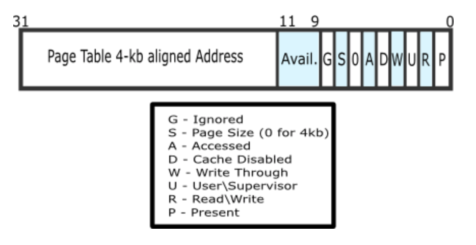
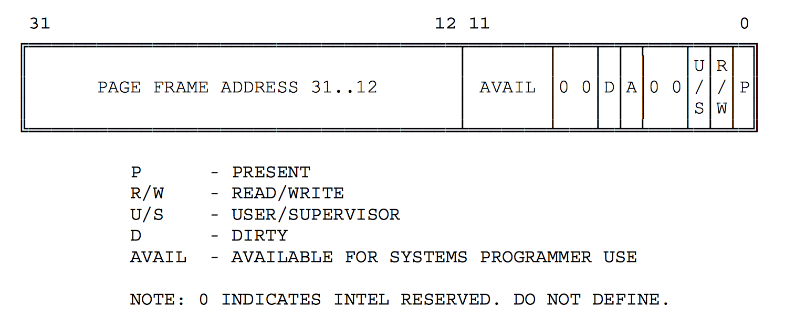
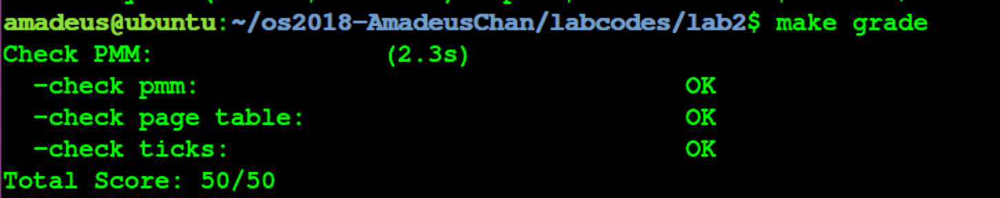

# 操作系统 Lab2 物理内存管理 实验报告


<!-- vim-markdown-toc GFM -->

* [实验目的](#实验目的)
* [实验内容](#实验内容)
* [基本练习](#基本练习)
	* [练习0：填写已有实验](#练习0填写已有实验)
	* [练习1：实现 first-fit 连续物理内存分配算法（需要编程）](#练习1实现-first-fit-连续物理内存分配算法需要编程)
	* [练习2：实现寻找虚拟地址对应的页表项（需要编程）](#练习2实现寻找虚拟地址对应的页表项需要编程)
	* [练习3：释放某虚地址所在的页并取消对应二级页表项的映射（需要编程）](#练习3释放某虚地址所在的页并取消对应二级页表项的映射需要编程)
* [参考答案分析](#参考答案分析)
	* [练习1](#练习1)
	* [练习2](#练习2)
	* [练习3](#练习3)
* [实验中涉及的知识点列举](#实验中涉及的知识点列举)
* [实验中未涉及的知识点列举](#实验中未涉及的知识点列举)
* [参考文献](#参考文献)

<!-- vim-markdown-toc -->

## 实验目的

- 理解基于段页式内存地址的转换机制 
- 理解页表的建立和使用方法 
- 理解物理内存的管理方法

## 实验内容

- 了解如何发现系统中的物理内存；
- 了解如何建立对物理内 存的初步管理，即了解连续物理内存管理;
- 了解页表相关的操作，即如何建立页表来实现虚拟内存到物理内存之间的映射，对段页式内存管理机制有一个比较全面的了解;

## 基本练习

### 练习0：填写已有实验

将LAB1中完成的代码（不包含拓展练习）移植到了lab2的框架中，涉及到的文件为kern/debug/kdebug.c和kern/trap/trap.c，具体内容已在LAB1报告中进行说明，此处不再赘述；

### 练习1：实现 first-fit 连续物理内存分配算法（需要编程）

- 下文中将对实现first-fit连续物理内存分配算法的实现过程进行简要说明：

	- 在ucore中采用面向对象编程的思想，将物理内存管理的内容抽象成若干个特定的函数，并且使用结构体pmm\_manager来将这些函数的指针封装起来，使得具体使用到物理内存管理所提供的服务的时候，只需要调用已经初始化完成的pmm\_manager的实例中的函数指针即可，这样就实现了将物理内存管理的具体实现与ucore其他部分隔离开来的效果。其中，上述若干个封装在pmm\_manager中的提供物理内存管理服务的函数分别如下：
		- init：对物理内存管理器的初始化；
		- init_memmap：对管理的空闲页的数据进行初始化；
		- alloc_pages：申请分配指定数量的物理页；
		- free_pages: 申请释放若干指定物理页；
		- nr_free_pages：查询当前的空闲页总数；
		- check: 对物理内存管理器进行测试；
	- 查看default\_pmm.c文件可以发现，最终ucore中所使用的物理内存管理器中的函数指针分别指向了default\_init, default\_init\_memmap等若干函数，在本实验中，为了方便起见，通过对这些函数的实现进行修改来实现first-fit 连续内存分配算法，当然，另外一个一个更加符合面向对象编程思想的思路是重新实现若干ff\_init, ff\_init\_memmap等专门为FF（first-fit）算法实现的函数，然后另外实例化一个使用了这些函数的内存管理器，然后将全局的默认内存管理器换成FF内存管理器即可；
	- 下文中对具体对于每一个设计物理内存管理的函数中的修改内容进行说明：
		- 首先查看default\_init中的内容，发现仅有对空闲内存块链表的初始化以及将总空闲数目置零的操作，这是与具体物理内存分配算法无关的，因此直接使用默认的函数实现即可；
			```c
			list_init(&free_list);     
			nr_free = 0;
			```
		- 接下来查看default\_init\_memmap函数，该函数的具体作用为对最初的一整块未被占用的物理内存空间中的每一页所对应的Page结构（用于描述这些页的状态）进行初始化，考虑到相邻的物理页对应的Page结构在内存上也是同样相邻的，因此可以直接通过第一个空闲物理页对应的Page结构加上一个偏移量的方式来访问所有的空闲的物理页的Page结构，具体初始化方式为：
			- 遍历所有空闲物理页的Page结构，将Page结构的描述空闲块的数目的成员变量置零（因此该成员变量只有在整个空闲块的第一个Page中才有意义），然后清空这些物理页的引用计数，然后通过设置flags的位的方式将其标记为空闲，具体的实现代码如下所示：
				```c
				struct Page *p = base;
				for (; p != base + n; p ++) {
				    assert(PageReserved(p));
				    p->flags = p->property = 0;
				    set_page_ref(p, 0);
				    SetPageProperty(p);
				}
				```
			- 接下来对空闲块的第一个页的Page结构进行初始化，具体实现为将其表示空闲块大小的成员变量设置为作为参数传入的空闲块大小（单位为页），然后更新存储所有空闲页数量的全局变量，然后将这个空闲块插入到空闲内存块链表中（只需要将第一个Page的page\_link插入即可）；具体的代码实现如下所示：
				```c
				base->property = n;
				nr_free += n;
				list_add(&free_list, &(base->page_link));
				```
			- 至此初始化空闲页信息完成；
		- 接下来考虑实现分配空闲页函数default\_alloc\_pages：该函数的具体功能为分配指定页数的连续空闲物理空间，并且将第一页的Page结构的指针作为结果返回；该函数的具体实现方式如下：
			- 对参数进行合法性检查，并且查询总的空闲物理页数目是否足够进行分配，如果不足够进行分配，直接返回NULL，表示分配失败；
			- 从头开始遍历保存空闲物理内存块的链表(按照物理地址的从小到大顺序)，如果找到某一个连续内存块的大小不小于当前需要的连续内存块大小，则说明可以进行成功分配（选择第一个遇到的满足条件的空闲内存块来完成内存分配）；具体代码实现如下所示：
				```c
				struct Page *page = NULL;
				list_entry_t *le = &free_list;
				while ((le = list_next(le)) != &free_list) {
					struct Page *p = le2page(le, page_link);
					if (p->property >= n) {
						page = p;
						break;
					}
				}
				```
			- 接下来考虑对获得的满足条件的空闲内存块进行处理，如果该内存块的大小大于需要的内存大小，则将空闲内存块分裂成两块，物理地址较小的一块分配出来进行使用（大小恰好为需要的物理内存的大小），而物理地址较大的那一块重新进行初始化（包括对第一个Page中表示空闲块大小的成员变量进行设置，其应当设置为原先的空闲块大小减掉分配掉的大小，以及将这个分裂出来的空闲块插入到空闲块链表中（该链表中的空闲块按照物理地址从小到大排序））；如果原先的空闲块大小刚好等于需要的内存大小，则没有比较进行分裂；于此同时，对分配出去的物理内存的每一个的描述信息（即对应的Page结构）进行初始化，具体为修改flags成员变量来将这些Page标记为非空闲，最后将原始空闲块在空闲块链表中删除掉，并且更新表示总空闲页数量的全局变量；最后用于表示分配到的物理内存的Page结构指针返回。具体实现的代码如下所示：
				```c
				if (page != NULL) { // 如果寻找到了满足条件的空闲内存块
					for (struct Page *p = page; p != (page + n); ++p) {
						ClearPageProperty(p); // 将分配出去的内存页标记为非空闲
					}
					if (page->property > n) { // 如果原先找到的空闲块大小大于需要的分配内存大小，进行分裂
						struct Page *p = page + n; // 获得分裂出来的新的小空闲块的第一个页的描述信息
						p->property = page->property - n; // 更新新的空闲块的大小信息
						list_add(&(page->page_link), &(p->page_link)); // 将新空闲块插入空闲块列表中
					}
					list_del(&(page->page_link)); // 删除空闲链表中的原先的空闲块
					nr_free -= n; // 更新总空闲物理页的数量
				}
				```
			- 至此完成了内存页分配的实现
		- 接下来考虑释放占用的内存块的函数default\_free\_pages，该函数的具体功能为释放指定的某一物理页开始的若干个连续物理页，并且完成first-fit算法中需要的若干信息的维护，具体的实现如下所示：
			- 首先考虑遍历需要释放的物理页的描述信息（即对应的Page结构），对其进行更新，具体内容为：
				- 判断原先这些物理页是否真的被占用了，如果释放未被占用的物理页，这说明出现了异常情况；
				- 设置flags来将这些物理页标记为空闲；
				- 清空这些物理页的引用计数；
			  具体的代码实现如下所示：
				```c
				struct Page *p = base;
				for (; p != (base + n); p ++) {
					assert(!PageReserved(p) && !PageProperty(p)); // 进行检查
					SetPageProperty(p); // 标记为空闲
					set_page_ref(p, 0); // 清空引用计数
				}
				```

			- 接下来将这一新的空闲块插入到空闲块链表中，具体代码实现如下：
				```c
				base->property = n; // 设置空闲块大小
				list_entry_t *le = list_next(&free_list); 
				for (; le != (&free_list) && le < (&(base->page_link)); le = list_next(le)); // 寻找新的空闲块在空闲块链表中应当处于的位置
				list_add_before(le, &(base->page_link)); // 将空闲块插入到链表中
				nr_free += n; // 更新空闲物理页总量
				```
			- 接下来需要对空闲块跟其相邻的空闲块（如果存在的话）进行合并，为此专门实现了一个函数merge\_backward，用于尝试将指定的某一个空闲块与其链表后的空闲块进行合并，如果合并失败则返回0，否则返回1，使用该函数可以简洁的完成所有合并操作，具体代码实现如下：
				```c
				while (merge_backward(base)); // 将新插入的空闲块和其物理地址大的一端的所有相邻的物理空闲块进行合并
				for (list_entry_t *i = list_prev(&(base->page_link)); i!= &free_list; i = list_prev(i)) { // 将新插入的空闲块和其物理地址小的一段的所有相邻的物理空闲块进行合并
					if (!merge_backward(le2page(i, page_link))) break;
				}
				```
				接下来通过具体实现代码对merge\_backward函数进行说明：
				```c
				static bool
				merge_backward(struct Page *base) {
					list_entry_t *le = list_next(&(base->page_link)); // 获取链表中下一块（物理地址大的一端）的相邻空闲块
					if (le == &free_list) return 0; // 如果此空闲块是物理地址最大的空闲块，则无法进行向后合并，返回合并失败
					struct Page *p = le2page(le, page_link);
					if (PageProperty(p) == 0) return 0;
					if (base + base->property != p) return 0; // 如果这两空闲块不是相邻的，无法进行合并
					base->property += p->property; // 进行空闲块合并
					p->property = 0;
					list_del(le); // 将合并前的物理地址较大的空闲块从链表中删去
					return 1; // 返回合并成功
				}
				```
	- 至此完成了整个first-fit算法的实现；


- 回答问题：你的first fit算法是否有进一步的改进空间？
	- 在本实验中所实现的first fit算法仍然有着相当的改进空间，其中最主要的不足我认为就在于时间效率上，每次查询第一块符合条件的空闲内存块时，最坏情况需要找遍整个链表，这样的话时间复杂度是O（N），N表示当前的链表大小，考虑针对时间效率的优化方式如下：
		- 采用splay等平衡二叉树结构来取代简单的链表结构来维护空闲块，其中按照中序遍历得到的空闲块序列的物理地址恰好按照从小到大排序；
		- 每个二叉树节点上维护该节点为根的子树上的最大的空闲块的大小；
		- 在每次进行查询的时候，不妨从根节点开始，查询左子树的最大空闲块是否符合要求，如果是的话进入左子树进行进一步查询，否则进入右子树；（二分查找）
		- 按照上述方法，最终可以查找到物理地址最小的能够满足条件的空闲地址块，将其splay到平衡树的根（如果使用splay树的话），然后进行删除以及新的分裂出来的空闲块的插入等操作；
		- 按照上述方法的话，每次查询符合条件的第一块物理空闲块的时间复杂度为O(log N)，对比原先的O（N）有了较大的改进；

### 练习2：实现寻找虚拟地址对应的页表项（需要编程）

- 本练习的要求为补全pmm.c中的get\_pte函数，如同函数名描述的一般，该函数的主要功能为根据给定的page directory以及线性地址，查询出该linear address对应的page table entry，并且根据输入参数要求判断是否创建不存在的页表，接下来将根据该函数的具体实现代码分析具体实现的过程：
```c
pde_t *pdep = pgdir + PDX(la); // 获取到页目录表中给定线性地址对应到的页目录项
pte_t *ptep = ((pte_t *) (KADDR(*pdep & ~0XFFF)) + PTX(la)); // 从找到的页目录项中查询到线性地址对应到的页表中的页表项，即页表基址加上线性地址的中的offset（第12...21位，从0开始）
if (*pdep & PTE_P) return ptep; // 检查查找到的页目录项是否存在，如果存在直接放回找到的页表项即可
if (!create) return NULL; // 如果该页目录项是不存在的，并且参数要求不创建新的页表，则直接返回
struct Page* pt = alloc_page(); // 如果需要按需创建新的页表，则请求一个物理页来存储新创建的页表
if (pt == NULL) return NULL; // 如果物理空间不足，直接返回
set_page_ref(pt, 1); // 更新该物理页的引用计数
ptep = KADDR(page2pa(pt)); // 获取到该物理页的虚拟地址（此时已经启动了page机制，内核地址空间），这是因为CPU执行的指令中使用的已经是虚拟地址了
memset(ptep, 0, PGSIZE); // 新创建的页表进行初始化
*pdep = (page2pa(pt) & ~0XFFF) | PTE_U | PTE_W | PTE_P; // 对原先的页目录项进行设置，包括设置其对应的页表的物理地址，以及包括存在位在内的标志位
return ptep + PTX(la); // 返回线性地址对应的页目录项
```

- 回答以下问题：
	- 请描述页目录项（Pag Director Entry）和页表（Page Table Entry）中每个组成部分的含义和以及对ucore而言的潜在用处。
		- 接下来描述页目录项的每个组成部分，PDE（页目录项）的具体组成如下图所示；描述每一个组成部分的含义如下[1]：
			- 前20位表示4K对齐的该PDE对应的页表起始位置（物理地址，该物理地址的高20位即PDE中的高20位，低12位为0）；
			- 第9-11位未被CPU使用，可保留给OS使用；
			- 接下来的第8位可忽略；
			- 第7位用于设置Page大小，0表示4KB；
			- 第6位恒为0；
			- 第5位用于表示该页是否被使用过；
			- 第4位设置为1则表示不对该页进行缓存；
			- 第3位设置是否使用write through缓存写策略；
			- 第2位表示该页的访问需要的特权级；
			- 第1位表示是否允许读写；
			- 第0位为该PDE的存在位；
			
		- 接下来描述页表项（PTE）中的每个组成部分的含义，具体组成如下图所示[2]：
			- 高20位与PDE相似的，用于表示该PTE指向的物理页的物理地址；
			- 9-11位保留给OS使用；
			- 7-8位恒为0；
			- 第6位表示该页是否为dirty，即是否需要在swap out的时候写回外存；
			- 第5位表示是否被访问；
			- 3-4位恒为0；
			- 0-2位分别表示存在位、是否允许读写、访问该页需要的特权级；
		- 可以发现无论是PTE还是TDE，都具有着一些保留的位供操作系统使用，也就是说ucore可以利用这些位来完成一些其他的内存管理相关的算法，比如可以在这些位里保存最近一段时间内该页的被访问的次数（仅能表示0-7次），用于辅助近似地实现虚拟内存管理中的换出策略的LRU之类的算法；也就是说这些保留位有利于OS进行功能的拓展；

			
	- 如果ucore执行过程中访问内存，出现了页访问异常，请问硬件要做哪些事情？
		- 当ucore执行过程中出现了页访问异常，硬件需要完成的事情分别如下：
			- 将发生错误的线性地址保存在cr2寄存器中;
			- 在中断栈中依次压入EFLAGS，CS, EIP，以及页访问异常码error code，如果page fault是发生在用户态，则还需要先压入ss和esp，并且切换到内核栈；
			- 根据中断描述符表查询到对应page fault的ISR，跳转到对应的ISR处执行，接下来将由软件进行page fault处理；

### 练习3：释放某虚地址所在的页并取消对应二级页表项的映射（需要编程）

- 接下来具体代码实现来说明释放某虚地址所在的页并且取消PTE表项的映射的具体实现：
```c
assert(*ptep & PTE_P); // 确保传入的二级页表项是存在的
struct Page *page = pte2page(*ptep); // 获取该页表项对应的物理页对应的Page结构
page->ref --; // 减少该物理页的引用计数
if (!page->ref) free_page(page); // 如果该物理页的引用计数变成0，即不存在任何虚拟页指向该物理页，释放该物理页
*ptep &= (~PTE_P); // 将PTE的存在位设置为0，表示该映射关系无效
tlb_invalidate(pgdir, la); // 刷新TLB，保证TLB中的缓存不会有错误的映射关系
```

- 回答如下问题：

	- 数据结构Page的全局变量（其实是一个数组）的每一项与页表中的页目录项和页表项有无对应关系？如果有，其对应关系是啥？
		- 存在对应关系：由于页表项中存放着对应的物理页的物理地址，因此可以通过这个物理地址来获取到对应到的Page数组的对应项，具体做法为将物理地址除以一个页的大小，然后乘上一个Page结构的大小获得偏移量，使用偏移量加上Page数组的基地址皆可以或得到对应Page项的地址；
	- 如果希望虚拟地址与物理地址相等，则需要如何修改lab2，完成此事？ 鼓励通过编程来具体完成这个问题。
		- 由于在完全启动了ucore之后，虚拟地址和线性地址相等，都等于物理地址加上0xc0000000，如果需要虚拟地址和物理地址相等，可以考虑更新gdt，更新段映射，使得virtual address = linear address - 0xc0000000，这样的话就可以实现virtual address = physical address；

- 最终完成所有练习之后，可以通过make grade的所有测试，最终实验结果如下所示：



## 参考答案分析

接下来对所给出的参考答案进行分析，与本实验中的实现进行对比：

### 练习1

- 由于代码实现本身比较简单，本实验的在default\_init, default\_memmap的实现上与参考答案的思路基本一致，因此不进行赘述；
- 关于default\_alloca\_pages函数的实现，本实验与参考答案的实验的区别如下所示：
	- 在实现遍历空闲块链表部分，本实验中的实现时先找到符合条件的块，然后退出遍历过程，对空闲块进行处理，而参考答案是直接在遍历过程中进行处理，然后再直接退出函数；
	- 答案的实现中，空闲块链表上保存了所有的空闲的物理页对应的Page，而本实验的实现中，空闲块链表上仅存了所有连续空闲块的第一个物理页对应的Page，本人的实现减小了该链表的长度，有利于提高时间效率；
- 接下来讨论default\_free\_pages函数的实现区别：
	- 同样，由于上述提及到的存储在空闲块链表上的内容的不同，本人的实现在删除只需要将某个物理空闲块的第一页从链表上摘下来即可，而参考答案的实现需要将整个空闲块的所有页都从链表上删除掉；
	- 在完成空闲块的合并方便，本实验中的实现将合并操作抽出来形成单独的函数，使得代码思路更加清晰；

### 练习2

- 由于练习2中的代码思路较为简单，本实验中的实现与参考答案的区别仅仅体现在一些具体的代码描述上，比如说在获取页目录表的某一项的时候，参考答案使用`pgdir[PDX(la)]`进行获取，而本实验中的实现使用呢了`pgdir + PDX(la)`进行获取；两者描述没有具体的优劣之分；

### 练习3

- 由于练习3的代码实现较为简单，本实验中的实现与参考答案基本没有区别，因此不再赘述；

## 实验中涉及的知识点列举

列举本次实验中涉及到的知识点如下：
- 80386 CPU的段页式内存管理机制，以及进入页机制的方法；
- 对物理内存的探测的方法；
- 具体的连续物理内存分配算法，包括first-fit，best-fit等一系列策略；
- ucore中链表的实现方法；
- 在C语言中使用面向对象思想实现物理内存管理器；
- 链接地址、虚拟地址、线性地址、物理地址以及ELF二进制可执行文件中各个段的含义；

对应到的OS中的知识点如下：
- 内存页管理机制；
- 连续物理内存管理；

两者之间的对应关系为：
- 前者为后者提供了具体完成某一个平台上的操作系统对应的内存管理功能的底层支持；
- 同时在实验中设计到的其他一些知识点，比如面向对象思想、链表的使用等，方便了具体的操作系统的实现编码；

## 实验中未涉及的知识点列举

实验中未涉及的知识点包括：
- 虚拟内存管理，包括在物理内存不足的情况下将暂时使用不到的物理页换出到外存中，从而实现大于物理内存空间的虚拟内存空间；
- PageFault的处理；
- OS中的进程、线程的创建、管理、调度过程，以及进程间的同步互斥；
- OS中用于访问外存的文件系统；
- OS对IO设备的管理；
- 从内核态跳转到用户态的方式；

## 参考文献

- [1] https://wiki.osdev.org/Paging
- [2] INTEL 80386 PROGRAMMER'S REFERENCE MANUAL 1986
