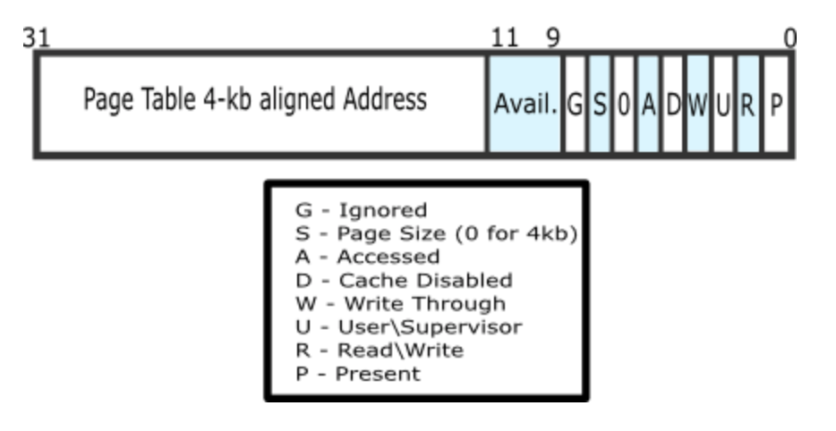
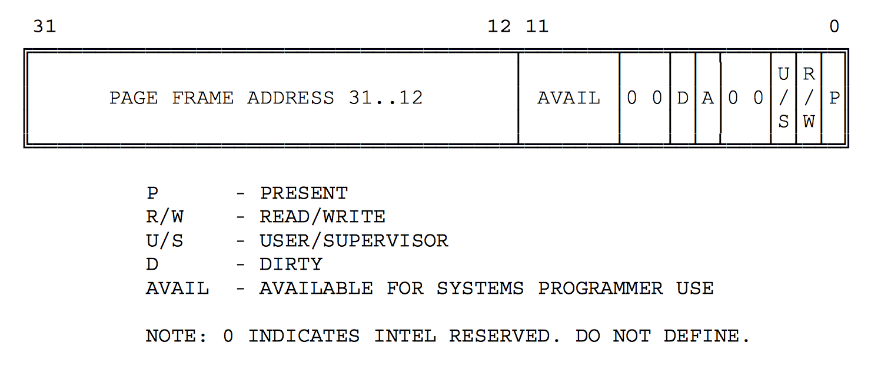
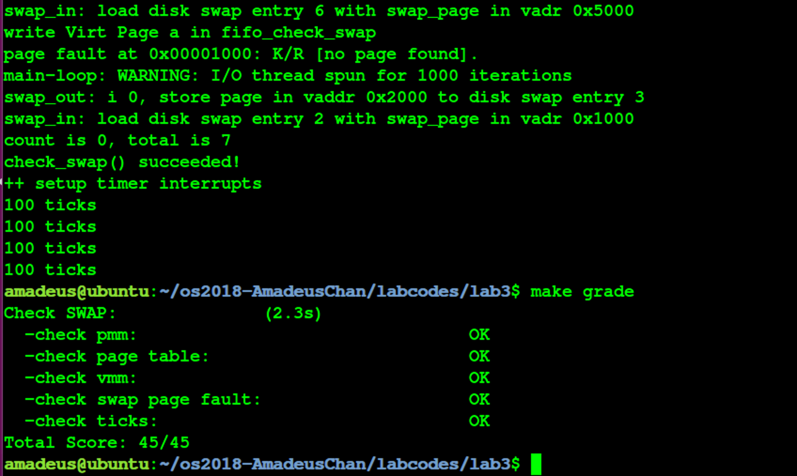

# 操作系统 Lab3 虚拟内存管理 实验报告


<!-- vim-markdown-toc GFM -->

* [实验目的](#实验目的)
* [实验内容](#实验内容)
* [基本练习](#基本练习)
	* [练习0：填写已有实验](#练习0填写已有实验)
	* [练习1：给未被映射的地址映射上物理页（需要编程）](#练习1给未被映射的地址映射上物理页需要编程)
		* [设计实现](#设计实现)
		* [问题回答](#问题回答)
	* [练习2：补充完成基于FIFO的页面替换算法（需要编程）](#练习2补充完成基于fifo的页面替换算法需要编程)
		* [设计实现](#设计实现-1)
		* [问题回答](#问题回答-1)
	* [实验结果](#实验结果)
* [参考答案分析](#参考答案分析)
* [实验中涉及的知识点列举](#实验中涉及的知识点列举)
* [实验中未涉及的知识点列举](#实验中未涉及的知识点列举)
* [参考文献](#参考文献)

<!-- vim-markdown-toc -->

## 实验目的

- 了解虚拟内存的Page Fault异常处理实现
- 了解页替换算法在操作系统中的实现

## 实验内容

- 完成 Page Fault异常处理和FIFO页替换算法的实现;
- 结合磁盘提供的缓存空间，从而能够支持虚 存管理，提供一个比实际物理内存空间“更大”的虚拟内存空间给系统使用;

## 基本练习

### 练习0：填写已有实验

在本练习中将LAB1/2的实验内容移植到了LAB3的实验框架内，由于手动进行内容移植比较烦杂，因此考虑使用diff和patch工具进行自动化的移植，具体使用的命令如下所示：（对于patch工具进行合并的时候产生冲突的少部分内容，则使用\*.rej, \*.orig文件来手动解决冲突问题）

```
diff -r -u -P lab2_origin lab2 > lab2.patch
cd lab3
patch -p1 -u < ../lab2.patch
```

### 练习1：给未被映射的地址映射上物理页（需要编程）

完成do_pgfault（mm/vmm.c）函数，给未被映射的地址映射上物理页。设置访问权限 的时候 需要参考页面所在 VMA 的权限，同时需要注意映射物理页时需要操作内存控制 结构所指定 的页表，而不是内核的页表。

#### 设计实现

- 在lab2中完成了对物理内存的管理以及使能了页机制，而在本次实验中则进一步对内存管理进行了完善，使得ucore支持虚拟内存管理，这使得可能出现某一些虚拟内存空间是合法的（在vma中），但是还没有为其分配具体的内存页，这样的话，在访问这些虚拟页的时候就会产生pagefault异常，从而使得OS可以在异常处理时完成对这些虚拟页的物理页分配，在中端返回之后就可以正常进行内存的访问了。在完成练习之前，不妨首先分析一下在ucore操作系统中，如果出现了page fault，应当进行怎样的处理流程。不妨对ucore的代码分析如下：
	- 首先与其他中端的处理相似的，硬件会将程序状态字压入中端栈中，与ucore中的部分中端处理代码一起建立起一个trapframe，并且硬件还会将出现了异常的线性地址保存在cr2寄存器中；
	- 与通常的中断处理一样，最终page fault的处理也会来到trap_dispatch函数，在该函数中会根据中断号，将page fault的处理交给pgfault_handler函数，进一步交给do_pgfault函数进行处理，因此do_pgfault函数便是我们最终需要用来对page fault进行处理的地方；

- 因此接下来不妨对do_pgfault函数进行分析：
	- 该函数的传入参数总共有三个，其中第一个是一个mm_struct变量，其中保存了所使用的PDT，合法的虚拟地址空间（使用链表组织），以及与后文的swap机制相关的数据；而第二个参数是产生pagefault的时候硬件产生的error code，可以用于帮助判断发生page fault的原因，而最后一个参数则是出现page fault的线性地址（保存在cr2寄存器中的线性地址）；
	- 在函数中，首先查询mm_struct中的合法的虚拟地址(事实上是线性地址，但是由于在ucore中弱化了段机制，段仅仅起到对等映射的作用，因此虚拟地址等于线性地址)链表，用于确定当前出现page fault的线性地址是否合法，如果合法则继续执行调出物理页，否则直接返回；
	- 接下来使用error code（其中包含了这次内存访问是否为读/写，以及对应的物理页是否存在），以及查找到的该线性地址的内存页是否允许读写来判断是否出现了读/写不允许读/写的页这种情况，如果出现了上述情况，则应该直接返回，否则继续执行page fault的处理流程；
	- 接下来根据合法虚拟地址（mm_struct中保存的合法虚拟地址链表中可查询到）的标志，来生成对应产生的物理页的权限；
	- 接下来的部分则是在本练习中需要完成代码补全的部分，首先使用在lab2中实现的函数get\_pte来获取出错的线性地址对应的虚拟页起始地址对应到的页表项，在ucore中同时使用页表项来保存物理地址（在Present位为1的时候）以及被换出的物理页在swap外存中的位置（以页为单位，每页大小刚好为8个扇区，此时P位为0），并且规定swap中的第0个页空出来不用于交换，因此如果查询到的PTE不为0，则表示对应的物理页可能在内存中或者在外存中（根据P位决定），否则则表示对应的物理页尚未被分配，此时则需要调用在lab2中实现的内存分配功能来获取对应的物理页，并且将其与当前的虚拟页设置上映射关系，这个部分在lab3中被封装成了pgdir_alloc_page函数；根据上述分析练习1中需要编写的代码实现如下：
	```c
	ptep = get_pte(mm->pgdir, addr, 1); // 获取当前发生缺页的虚拟页对应的PTE
	if (*ptep == 0) { // 如果需要的物理页是没有分配而不是被换出到外存中
		struct Page* page = pgdir_alloc_page(mm->pgdir, addr, perm); // 分配物理页，并且与对应的虚拟页建立映射关系
	} else {
		// 将物理页从外存换到内存中，练习2中需要实现的内容
	}
	```
	- 至此则完成了page fault中对于未映射的虚拟（线性）地址映射上物理页的过程；

#### 问题回答

- 请描述页目录项（Page Director Entry）和页表（Page Table Entry）中组成部分对ucore实现页替换算法的潜在用处。

	- 首先不妨先分析PDE以及PTE中各个组成部分以及其含义；
	- 接下来先描述页目录项的每个组成部分，PDE（页目录项）的具体组成如下图所示；描述每一个组成部分的含义如下[1]：
			- 前20位表示4K对齐的该PDE对应的页表起始位置（物理地址，该物理地址的高20位即PDE中的高20位，低12位为0）；
			- 第9-11位未被CPU使用，可保留给OS使用；
			- 接下来的第8位可忽略；
			- 第7位用于设置Page大小，0表示4KB；
			- 第6位恒为0；
			- 第5位用于表示该页是否被使用过；
			- 第4位设置为1则表示不对该页进行缓存；
			- 第3位设置是否使用write through缓存写策略；
			- 第2位表示该页的访问需要的特权级；
			- 第1位表示是否允许读写；
			- 第0位为该PDE的存在位；
			
		- 接下来描述页表项（PTE）中的每个组成部分的含义，具体组成如下图所示[2]：
			- 高20位与PDE相似的，用于表示该PTE指向的物理页的物理地址；
			- 9-11位保留给OS使用；
			- 7-8位恒为0；
			- 第6位表示该页是否为dirty，即是否需要在swap out的时候写回外存；
			- 第5位表示是否被访问；
			- 3-4位恒为0；
			- 0-2位分别表示存在位、是否允许读写、访问该页需要的特权级；
		- 可以发现无论是PTE还是TDE，都具有着一些保留的位供操作系统使用，也就是说ucore可以利用这些位来完成一些其他的内存管理相关的算法，比如可以在这些位里保存最近一段时间内该页的被访问的次数（仅能表示0-7次），用于辅助近似地实现虚拟内存管理中的换出策略的LRU之类的算法；也就是说这些保留位有利于OS进行功能的拓展；

			
	- 通过上述分析可以发现，无论是页目录项还是页表项，表项中均保留了3位供操作系统进行使用，可以为实现一些页替换算法的时候提供支持，并且事实上在PTE的Present位为0的时候，CPU将不会使用PTE上的内容，这就使得当P位为0的时候，可以使用PTE上的其他位用于保存操作系统需要的信息，事实上ucore也正是利用这些位来保存页替换算法里被换出的物理页的在交换分区中的位置；此外PTE中还有dirty位，用于表示当前的页是否经过修改，这就使得OS可以使用这个位来判断是否可以省去某些已经在外存中存在着，内存中的数据与外存相一致的物理页面换出到外存这种多余的操作；而PTE和PDE中均有表示是否被使用过的位，这就使得OS可以粗略地得知当前的页面是否具有着较大的被访问概率，使得OS可以利用程序的局部性原理来对也替换算法进行优化(时钟替换算法中使用)；

- 如果ucore的缺页服务例程在执行过程中访问内存，出现了页访问异常，请问硬件要做哪些事情？

	- 考虑到ucore的缺页服务例程如果在访问内容中出现了缺页异常，则会有可能导致ucore最终无法完成缺页的处理，因此一般不应该将缺页的ISR以及OS中的其他一些关键代码或者数据换出到外存中，以确保操作系统的正常运行；
	- 如果缺页ISR在执行过程中遇到页访问异常，则最终硬件需要完成的处理与正常出现页访问异常的处理相一致，均为：
		- 将发生错误的线性地址保存在cr2寄存器中;
		- 在中断栈中依次压入EFLAGS，CS, EIP，以及页访问异常码error code，由于ISR一定是运行在内核态下的，因此不需要压入ss和esp以及进行栈的切换；
		- 根据中断描述符表查询到对应页访问异常的ISR，跳转到对应的ISR处执行，接下来将由软件进行处理；

### 练习2：补充完成基于FIFO的页面替换算法（需要编程）

完成vmm.c中的do_pgfault函数，并且在实现FIFO算法的swap_fifo.c中完成map_swappable 和swap_out_vistim函数。通过对swap的测试。

#### 设计实现

- 根据练习1中的分析，可以知道最终page fault的处理会转交给do_pgfault函数进行处理，并且在该函数最后，如果通过page table entry获知对应的物理页被换出在外存中，则需要将其换入内存，之后中断返回之后便可以进行正常的访问处理。这里便涉及到了以下若干个关于换入的问题：
	- 应当在何处获取物理页在外存中的位置？
		- 物理页在外存中的位置保存在了PTE中；
	- 如果当前没有了空闲的内存页，应当将哪一个物理页换出到外存中去？
		- 这里涉及到了将物理页换出的问题，对于不同的算法会有不同的实现，在本练习中所实现的FIFO算法则选择将在内存中驻留时间最长的物理页换出；
- 在进行了上述分析之后，便可以进行具体的实现了，实现的流程如下：
	- 判断当前是否对交换机制进行了正确的初始化；
	- 将虚拟页对应的物理页从外存中换入内存；
	- 给换入的物理页和虚拟页建立映射关系；
	- 将换入的物理页设置为允许被换出；
- 而具体的代码实现如下所示：
	```c
	ptep = get_pte(mm->pgdir, addr, 1); // 获取当前发生缺页的虚拟页对应的PTE
	if (*ptep == 0) { // 如果需要的物理页是没有分配而不是被换出到外存中
		struct Page* page = pgdir_alloc_page(mm->pgdir, addr, perm); // 分配物理页，并且与对应的虚拟页建立映射关系
	} else {
	        if (swap_init_ok) { // 判断是否当前交换机制正确被初始化
	    	    struct Page *page = NULL;
	    	    swap_in(mm, addr, &page); // 将物理页换入到内存中
	    	    page_insert(mm->pgdir, page, addr, perm); // 将物理页与虚拟页建立映射关系
	    	    swap_map_swappable(mm, addr, page, 1); // 设置当前的物理页为可交换的
	    	    page->pra_vaddr = addr; // 同时在物理页中维护其对应到的虚拟页的信息，这个语句本人觉得最好应当放置在page_insert函数中进行维护，在该建立映射关系的函数外对物理page对应的虚拟地址进行维护显得有些不太合适
	        } else {
	        	cprintf("no swap_init_ok but ptep is %x, failed\n",*ptep);
	        	goto failed;
	        }
	}
	```
- 对上述代码进行分析，发现当调用swap_in函数的时候，会进一步调用alloc_page函数进行分配物理页，一旦没有足够的物理页，则会使用swap_out函数将当前物理空间的某一页换出到外存，该函数会进一步调用sm（swap manager）中封装的swap_out_victim函数来选择需要换出的物理页，该函数是一个函数指针进行调用的，具体对应到了`_fifo_swap_out_victim`函数（因为在本练习中使用了FIFO替换算法），在FIFO算法中，按照物理页面换入到内存中的顺序建立了一个链表，因此链表头处便指向了最早进入的物理页面，也就在在本算法中需要被换出的页面，因此只需要将链表头的物理页面取出，然后删掉对应的链表项即可；具体的代码实现如下所示：
	```c
	list_entry_t *head=(list_entry_t*) mm->sm_priv; // 找到链表的入口
	assert(head != NULL); // 进行一系列检查
	assert(in_tick==0);
	list_entry_t *le = list_next(head); // 取出链表头，即最早进入的物理页面
	assert(le != head); // 确保链表非空
	struct Page *page = le2page(le, pra_page_link); // 找到对应的物理页面的Page结构
	list_del(le); // 从链表上删除取出的即将被换出的物理页面
	*ptr_page = page;
	```
- 在进行page fault处理中还有另外一个与交换相关的函数，swap_map_swappable，用于将指定的物理页面设置为可被换出，分析代码可以发现，该函数是sm中的swap_map_swappable函数的一个简单封装，对应到FIFO算法中实现的`_fifo_swap_map_swappable`函数，这也是在本次练习中需要进行实现的另外一个函数，这个函数的功能比较简单，就是将当前的物理页面插入到FIFO算法中维护的可被交换出去的物理页面链表中的末尾，从而保证该链表中越接近链表头的物理页面在内存中的驻留时间越长；该函数的一个具体实现如下所示：
	```c
	list_entry_t *head=(list_entry_t*) mm->sm_priv; // 找到链表入口
	list_entry_t *entry=&(page->pra_page_link); // 找到当前物理页用于组织成链表的list_entry_t
	assert(entry != NULL && head != NULL); 
	list_add_before(head, entry); // 将当前指定的物理页插入到链表的末尾
	```
- 至此完成了所有练习2的编程任务;


#### 问题回答

- 如果要在ucore上实现"extended clock页替换算法"请给你的设计方案，现有的swap_manager框架是否足以支持在ucore中实现此算法？如果是，请给你的设计方案。如果不是，请给出你的新的扩展和基此扩展的设计方案。并需要回答如下问题
	- 在现有框架基础上可以支持Extended clock算法，具体设计方案如下所示：
		- 根据上文中提及到的PTE的组成部分可知，PTE中包含了dirty位和访问位，因此可以确定某一个虚拟页是否被访问过以及写过，但是，考虑到在替换算法的时候是将物理页面进行换出，而可能存在着多个虚拟页面映射到同一个物理页面这种情况，也就是说某一个物理页面是否dirty和是否被访问过是有这些所有的虚拟页面共同决定的，而在原先的实验框架中，物理页的描述信息Page结构中默认只包括了一个对应的虚拟页的地址，应当采用链表的方式，在Page中扩充一个成员，把物理页对应的所有虚拟页都给保存下来；而物理页的dirty位和访问位均为只需要某一个对应的虚拟页对应位被置成1即可置成1；
		- 完成了上述对物理页描述信息的拓展之后，考虑对FIFO算法的框架进行修改得到拓展时钟算法的框架，由于这两种算法都是将所有可以换出的物理页面均按照进入内存的顺序连成一个环形链表，因此初始化，将某个页面置为可以/不可以换出这些函数均不需要进行大的修改(小的修改包括在初始化当前指针等)，唯一需要进行重写的函数是选择换出物理页的函数swap_out_victim，对该函数的修改如下：
			- 从当前指针开始，对环形链表进行扫描，根据指针指向的物理页的状态（表示为(access, dirty)）来确定应当进行何种修改：
				- 如果状态是(0, 0)，则将该物理页面从链表上去下，该物理页面记为换出页面，但是由于这个时候这个页面不是dirty的，因此事实上不需要将其写入swap分区；
				- 如果状态是(0, 1)，则将该物理页对应的虚拟页的PTE中的dirty位都改成0，并且将该物理页写入到外存中，然后指针跳转到下一个物理页；
				- 如果状态是(1, 0), 将该物理页对应的虚拟页的PTE中的访问位都置成0，然后指针跳转到下一个物理页面；
				- 如果状态是(1, 1)，则该物理页的所有对应虚拟页的PTE中的访问为置成0，然后指针跳转到下一个物理页面；
	- 需要被换出的页的特征是什么？
		- 该物理页在当前指针上一次扫过之前没有被访问过；
		- 该物理页的内容与其在外存中保存的数据是一致的, 即没有被修改过;

	- 在ucore中如何判断具有这样特征的页？
		- 在ucore中判断具有这种特征的页的方式已经在上文设计方案中提及过了，具体为：
			- 假如某物理页对应的所有虚拟页中存在一个dirty的页，则认为这个物理页为dirty，否则不这么认为；
			- 假如某物理页对应的所有虚拟页中存在一个被访问过的页，则认为这个物理页为被访问过的，否则不这么认为；

	- 何时进行换入和换出操作？
		- 在产生page fault的时候进行换入操作；
		- 换出操作源于在算法中将物理页的dirty从1修改成0的时候，因此这个时候如果不进行写出到外存，就会造成数据的不一致，具体写出内存的时机是比较细节的问题, 可以在修改dirty的时候写入外存，或者是在这个物理页面上打一个需要写出的标记，到了最终删除这个物理页面的时候，如果发现了这个写出的标记，则在这个时候再写入外存；后者使用一个写延迟标记，有利于多个写操作的合并，从而降低缺页的代价；

### 实验结果

最终的实验结果可以输出符合期望的结果，并且通过了make grade的测试，如下图所示：



## 参考答案分析

接下来对参考答案与本实验的实现进行分析比较，可以得到其主要区别分别有以下主要两点：

- 参考答案的实现中比本实验的实现多了若干处关于出错情况的特判，包括调用alloc_page函数分配内存失败的处理等，显然对于一个实际能够使用的操作系统而言，异常处理是非常重要的，操作系统需要不因为任何异常情况而崩溃；本实验的实现在实现的可靠性方面存在明显的不足，需要吸取教训，在之后进行改进；由于ucore中没有可以构造出极端的错误情况（比如内存不足），因此其实能够通过测试纯属侥幸；
- 参考答案对于存储可交换出去的物理页的链表的组织顺序与本实验中的实现恰好相反，在本实验中，链表入口的下一个物理页就刚好是在内存中驻留时间最长的物理页，而在参考答案的实现中，该位置的物理页是驻留时间最短的物理页；

## 实验中涉及的知识点列举

在本次实验中所涉及到的知识点有：
- 虚拟内存管理的基本概念与原理；
- page fault异常的处理流程；
- 页替换算法；
- 物理内存的管理；

对应到的操作系统中的知识点分别有：
- 操作系统中虚拟内存机制的实现；
- 操作系统中对具体某一个页面替换算法的实现；
- 操作系统中的中断处理机制；

它们之间的关系为，前者的知识点为后者中操作系统中的具体实现提供了理论基础(比如说页替换算法就为OS中具体实现swap out的机制提供了基础)；

## 实验中未涉及的知识点列举

在本次实验中未涉及到的知识点有：
- 操作系统中的进程、线程的管理与调度；
- 操作系统中的进程间的同步互斥机制；
- 操作系统访问外设或者外存所使用的文件系统以及虚拟文件系统；
- 操作系统的启动过程；
- 操作系统对IO设备的管理机制；

## 参考文献
- https://www.ugrad.cs.ubc.ca/~cs404/2013W1/notes/U02-BPManagement.pdf
