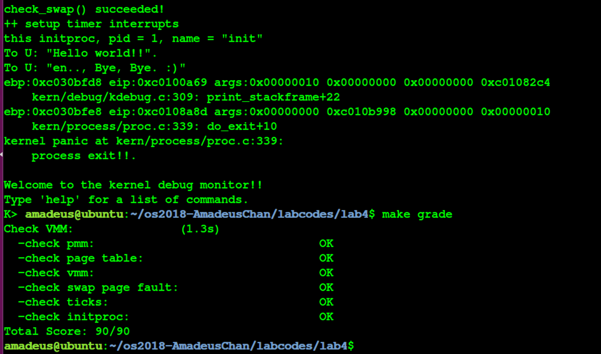

# 操作系统 Lab4 内核线程管理 实验报告


<!-- vim-markdown-toc GFM -->

* [实验目的](#实验目的)
* [实验内容](#实验内容)
* [基本练习](#基本练习)
	* [练习0：填写已有实验](#练习0填写已有实验)
	* [练习1：分配并初始化一个进程控制块（需要编码）](#练习1分配并初始化一个进程控制块需要编码)
		* [设计实现](#设计实现)
		* [问题回答](#问题回答)
	* [练习2：为新创建的内核线程分配资源（需要编码）](#练习2为新创建的内核线程分配资源需要编码)
		* [设计实现](#设计实现-1)
		* [问题回答](#问题回答-1)
	* [练习3：阅读代码，理解 proc_run 函数和它调用的函数如何完成 进程切换的。（无编码工作）](#练习3阅读代码理解-proc_run-函数和它调用的函数如何完成-进程切换的无编码工作)
		* [分析](#分析)
		* [问题回答](#问题回答-2)
	* [实验结果](#实验结果)
* [参考答案分析](#参考答案分析)
* [实验中涉及的知识点列举](#实验中涉及的知识点列举)
* [实验中未涉及的知识点列举](#实验中未涉及的知识点列举)

<!-- vim-markdown-toc -->

## 实验目的

- 了解内核线程创建/执行的管理过程
- 了解内核线程的切换和基本调度过程

## 实验内容

- 实现内核线程的创建与管理；

## 基本练习

### 练习0：填写已有实验

在本练习中将LAB1/2/3的实验内容移植到了LAB4的实验框架内，由于手动进行内容移植比较烦杂，因此考虑使用diff和patch工具进行自动化的移植，具体使用的命令如下所示：（对于patch工具进行合并的时候产生冲突的少部分内容，则使用\*.rej, \*.orig文件来手动解决冲突问题）

```
diff -r -u -P lab2_origin lab3 > lab3.patch
cd lab4
patch -p1 -u < ../lab3.patch
```

### 练习1：分配并初始化一个进程控制块（需要编码）

alloc_proc函数（位于kern/process/proc.c中）负责分配并返回一个新的struct proc_struct结 构，用于存储新建立的内核线程的管理信息。ucore需要对这个结构进行最基本的初始化，你 需要完成这个初始化过程。

#### 设计实现

本练习的编码工作集中在proc.c中的alloc_proc函数中，该函数的具体含义为创建一个新的进程控制块，并且对控制块中的所有成员变量进行初始化，根据实验指导书中的要求，除了指定的若干个成员变量之外，其他成员变量均初始化为0，取特殊值的成员变量如下所示：

```c
proc->state = PROC_UNINIT;
proc->pid = -1;
proc->cr3 = boot_cr3; // 由于是内核线程，共用一个虚拟内存空间
```

对于其他成员变量中占用内存空间较大的，可以考虑使用memset函数进行初始化，最终初始化所使用的代码如下所示：

```c
    struct proc_struct *proc = kmalloc(sizeof(struct proc_struct)); // 为线程控制块分配空间
    if (proc != NULL) {
	    proc->state = PROC_UNINIT; // 初始化具有特殊值的成员变量
	    proc->cr3 = boot_cr3;
	    proc->pid = -1;
	    proc->runs = 0; // 对其他成员变量清零处理
	    proc->kstack = 0;
	    proc->need_resched = 0;
	    proc->parent = NULL;
	    proc->mm = NULL;
	    memset(&proc->context, 0, sizeof(struct context)); // 使用memset函数清零占用空间较大的成员变量，如数组，结构体等
	    proc->tf = NULL;
	    proc->flags = 0;
	    memset(proc->name, 0, PROC_NAME_LEN);
    }
```

至此，本练习中的编码任务完成；

#### 问题回答

- 请说明proc_struct中struct context context和struct trapframe \*tf成员变量含义和在本实验中的作用是啥？（提示通过看代码和编程调试可以判断出来）

	- struct context context的作用：
		- 首先不妨查看struct context结构体的定义，可以发现在结构体中存储这除了eax之外的所有通用寄存器以及eip的数值，这就提示我们这个线程控制块中的context很有可能是保存的线程运行的上下文信息；
		```c
		struct context {
		    uint32_t eip;
		    uint32_t esp;
		    uint32_t ebx;
		    uint32_t ecx;
		    uint32_t edx;
		    uint32_t esi;
		    uint32_t edi;
		    uint32_t ebp;
		};
		```
		- 接下来使用find grep命令查找在ucore中对context成员变量进行了设置的代码，总共可以发现两处，分别为Swtich.S和proc.c中的copy_thread函数中，在其他部分均没有发现对context的引用和定义（除了初始化）；那么根据Swtich中代码的语义，可以确定context变量的意义就在于内核线程之间进行切换的时候，将原先的线程运行的上下文保存下来这一作用，那么为什么没有对eax进行保存呢？注意到在进行切换的时候调用了switch_to这一个函数，也就是说这个函数的里面才是线程之间切换的切换点，而在这个函数里面，由于eax是一个caller-save寄存器，并且在函数里eax的数值一直都可以在栈上找到对应，因此没有比较对其进行保存。
	- struct trapframe \*tf的作用：
		- 接下来同样在代码中寻找对tf变量进行了定义的地方，最后可以发现在copy_thread函数中对tf进行了设置，但是值得注意的是，在这个函数中，同时对context变量的esp和eip进行了设置，前者设置为tf变量的地址、后者设置为forkret这个函数的指针，接下来观察forkret函数，发现这个函数最终调用了\_\_trapret进行中断返回，这样的话tf变量的作用就变得清晰起来了：tf变量的作用在于在构造出了新的线程的时候，如果要将控制权交给这个线程，是使用中断返回的方式进行的（跟lab1中切换特权级类似的技巧），因此需要构造出一个伪造的中断返回现场，也就是trapframe，使得可以正确地将控制权转交给新的线程；具体切换到新的线程的做法为，调用switch_to函数，然后在该函数中进行函数返回，直接跳转到forkret函数，最终进行中断返回函数\_\_trapret，之后便可以根据tf中构造的中断返回地址，切换到新的线程了；

### 练习2：为新创建的内核线程分配资源（需要编码）

创建一个内核线程需要分配和设置好很多资源。kernel_thread函数通过调用do_fork函数完成 具体内核线程的创建工作。do_kernel函数会调用alloc_proc函数来分配并初始化一个进程控 制块，但alloc_proc只是找到了一小块内存用以记录进程的必要信息，并没有实际分配这些资 源。ucore一般通过do_fork实际创建新的内核线程。do_fork的作用是，创建当前内核线程的 一个副本，它们的执行上下文、代码、数据都一样，但是存储位置不同。在这个过程中，需 要给新内核线程分配资源，并且复制原进程的状态。你需要完成在kern/process/proc.c中的 do_fork函数中的处理过程。

#### 设计实现
在本次练习中，主要需要实现的代码位于proc.c的do_fork函数中，该函数的语义为为内核线程创建新的线程控制块，并且对控制块中的每个成员变量进行正确的设置，使得之后可以正确切换到对应的线程中执行；接下来将结合具体的代码来说明本次练习的具体实现过程：

```c
proc = alloc_proc(); // 为要创建的新的线程分配线程控制块的空间
if (proc == NULL) goto fork_out; // 判断是否分配到内存空间
assert(setup_kstack(proc) == 0);  // 为新的线程设置栈，在本实验中，每个线程的栈的大小初始均为2个Page, 即8KB
assert(copy_mm(clone_flags, proc) == 0);  // 对虚拟内存空间进行拷贝，由于在本实验中，内核线程之间共享一个虚拟内存空间，因此实际上该函数不需要进行任何操作
copy_thread(proc, stack, tf); // 在新创建的内核线程的栈上面设置伪造好的中端帧，便于后文中利用iret命令将控制权转移给新的线程
proc->pid = get_pid(); // 为新的线程创建pid
hash_proc(proc); // 将线程放入使用hash组织的链表中，便于加速以后对某个指定的线程的查找
nr_process ++; // 将全局线程的数目加1
list_add(&proc_list, &proc->list_link); // 将线程加入到所有线程的链表中，便于进行调度
wakeup_proc(proc); // 唤醒该线程，即将该线程的状态设置为可以运行
ret = proc->pid; // 返回新线程的pid
```

- 至此，本练习中需要的编码任务全部完成；

#### 问题回答

- 请说明ucore是否做到给每个新fork的线程一个唯一的id？请说明你的分析和理由。
	- 可以。ucore中为新的fork的线程分配pid的函数为get_pid，接下来不妨分析该函数的内容:
		- 在该函数中使用到了两个静态的局部变量next\_safe和last\_pid，根据命名推测，在每次进入get_pid函数的时候，这两个变量的数值之间的取值均是合法的pid（也就是说没有被使用过），这样的话，如果有严格的next_safe > last_pid + 1，那么久可以直接取last_pid + 1作为新的pid（需要last_pid没有超出MAX_PID从而变成1）；
		- 如果在进入函数的时候，这两个变量之后没有合法的取值，也就是说next_safe > last_pid + 1不成立，那么进入循环，在循环之中首先通过` if (proc->pid == last_pid) `这一分支确保了不存在任何进程的pid与last_pid重合，然后再通过`if (proc->pid > last_pid && next_safe > proc->pid)`这一判断语句保证了不存在任何已经存在的pid满足：last_pid<pid<next_safe，这样就确保了最后能够找到这么一个满足条件的区间，获得合法的pid；
		- 之所以在该函数中使用了如此曲折的方法，维护一个合法的pid的区间，是为了优化时间效率，如果简单的暴力的话，每次需要枚举所有的pid，并且遍历所有的线程，这就使得时间代价过大，并且不同的调用get_pid函数的时候不能利用到先前调用这个函数的中间结果；

### 练习3：阅读代码，理解 proc_run 函数和它调用的函数如何完成 进程切换的。（无编码工作）

#### 分析

接下来对proc_run函数进行分析：
- 首先注意到在本实验框架中，唯一调用到这个函数是在线程调度器的schedule函数中，也就是可以推测proc_run的语义就是将当前的CPU的控制权交给指定的线程；
- 接下来结合代码分析函数的内部构成：
```c
void
proc_run(struct proc_struct *proc) {
    if (proc != current) { // 判断需要运行的线程是否已经运行着了
        bool intr_flag;
        struct proc_struct *prev = current, *next = proc;
        local_intr_save(intr_flag); // 关闭中断
        {
            current = proc; 
            load_esp0(next->kstack + KSTACKSIZE); // 设置TSS
            lcr3(next->cr3); // 修改当前的cr3寄存器成需要运行线程（进程）的页目录表
            switch_to(&(prev->context), &(next->context)); // 切换到新的线程
        }
        local_intr_restore(intr_flag);
    }
}
```
- 可以看到proc_run中首先进行了TSS以及cr3寄存器的设置，然后调用到了swtich_to函数来切换线程，根据上文中对switch_to函数的分析可以知道，在调用该函数之后，首先会恢复要运行的线程的上下文，然后由于恢复的上下文中已经将返回地址（copy_thread函数中完成）修改成了forkret函数的地址(如果这个线程是第一运行的话，否则就是切换到这个线程被切换出来的地址)，也就是会跳转到这个函数，最后进一步跳转到了\_\_trapsret函数，调用iret最终将控制权切换到新的线程；

#### 问题回答

- 在本实验的执行过程中，创建且运行了几个内核线程？
	- 总共创建了两个内核线程，分别为：
		- idleproc: 最初的内核线程，在完成新的内核线程的创建以及各种初始化工作之后，进入死循环，用于调度其他线程；
		- initproc: 被创建用于打印"Hello World"的线程；
- 语句 local_intr_save(intr_flag);....local_intr_restore(intr_flag);说明理由在这里有何作用? 请说明理由。
	- 该语句的左右是关闭中断，使得在这个语句块内的内容不会被中断打断，是一个原子操作；
	- 这就使得某些关键的代码不会被打断，从而不会一起不必要的错误；
	- 比如说在proc_run函数中，将current指向了要切换到的线程，但是此时还没有真正将控制权转移过去，如果在这个时候出现中断打断这些操作，就会出现current中保存的并不是正在运行的线程的中断控制块，从而出现错误；

### 实验结果

最终的实验结果符合预期，并且能够通过make grade脚本的检查，如下图所示：



## 参考答案分析

- 首先比较本实验中在练习1中的实现与参考答案的区别，由于该编码任务的内容仅仅是初始化TCB，比较简单，因此内容与参考答案基本一致；
- 接下来比较练习2中实现与参考答案的区别：
	- 参考答案多了在分配内存、设置栈的过程中失败的错误处理；
	- 参考答案中设置fork的线程的关键信息以及将其加入proc列表的时候关闭了中断，防止被中断打断操作，从而导致存储线程的信息的不一致；
- 通过与参考答案的对比，可以发现本实验中的实现还是忽略了许多必要的错误处理，以及没有考虑到中断打断当前的操作是否会带来错误，这使得本实验的实现的鲁棒性不如参考答案，需要吸取教训；

## 实验中涉及的知识点列举

在本次实验中设计到的知识点有：
- 线程控制块的概念以及组成；
- 切换不同线程的方法；

对应到的OS中的知识点有：
- 对内核线程的管理；
- 对内核线程之间的切换；

这两者之间的关系为，前者为后者在OS中的具体实现提供了基础；

## 实验中未涉及的知识点列举

在本次实验中未涉及的知识点有：
- OS的启动过程；
- OS中对物理、虚拟内存的管理；
- OS中对用户进程的管理；
- OS中对线程/进程的调度；

