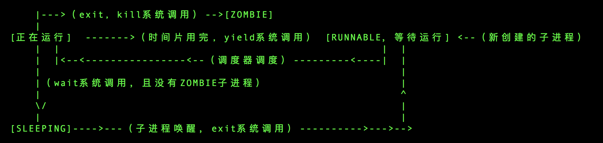
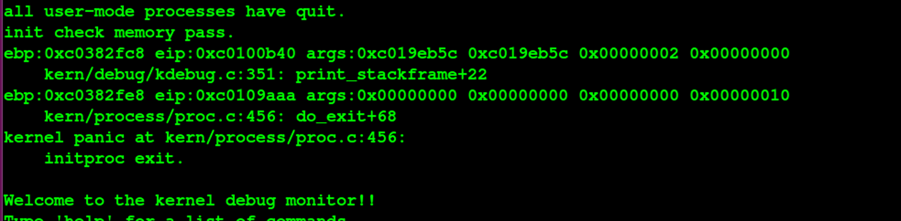
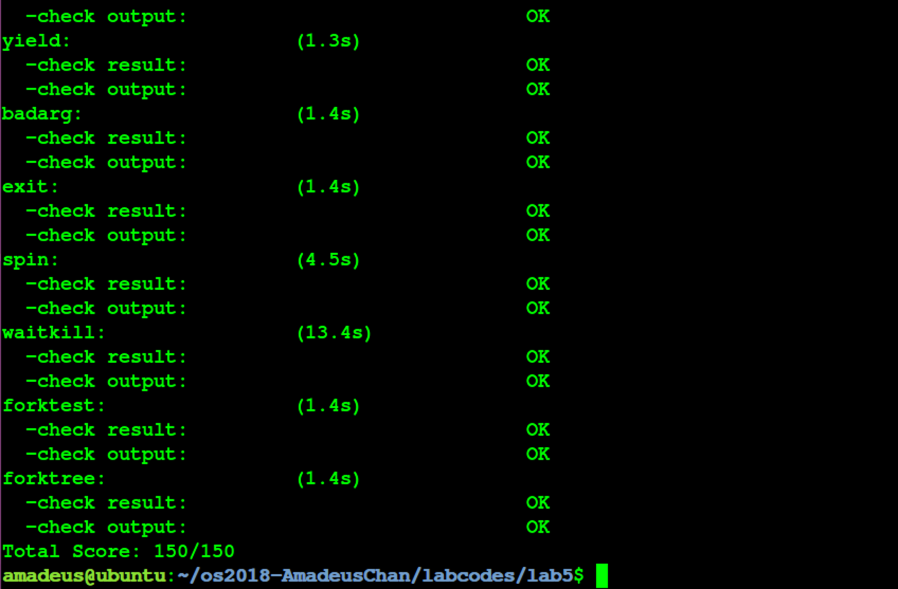

# 操作系统 Lab5 用户进程管理 实验报告


<!-- vim-markdown-toc GFM -->

* [实验目的](#实验目的)
* [实验内容](#实验内容)
* [基本练习](#基本练习)
	* [练习0：填写已有实验](#练习0填写已有实验)
	* [练习1：加载应用程序并执行（需要编码）](#练习1加载应用程序并执行需要编码)
		* [设计实现](#设计实现)
		* [问题回答](#问题回答)
	* [练习2：父进程复制自己的内存空间给子进程（需要编码）](#练习2父进程复制自己的内存空间给子进程需要编码)
		* [设计实现](#设计实现-1)
		* [问题回答](#问题回答-1)
	* [练习3：阅读分析源代码，理解进程执行 fork/exec/wait/exit 的实现，以及系统调用的实现（不需要编码）](#练习3阅读分析源代码理解进程执行-forkexecwaitexit-的实现以及系统调用的实现不需要编码)
		* [分析](#分析)
		* [问题回答](#问题回答-2)
	* [实验结果](#实验结果)
* [参考答案分析](#参考答案分析)
* [实验中涉及的知识点列举](#实验中涉及的知识点列举)
* [实验中未涉及的知识点列举](#实验中未涉及的知识点列举)
* [参考文献](#参考文献)

<!-- vim-markdown-toc -->

## 实验目的

- 了解第一个用户进程创建过程
- 了解系统调用框架的实现机制
- 了解ucore如何实现系统调用sys_fork/sys_exec/sys_exit/sys_wait来进行进程管理

## 实验内容

- 创建用户进程，让用户进程在用户态执行;
- 支持ucore的系统调用为用户进程提供服务；
- 完成对用户进程的执行过程的基本管理;

## 基本练习

### 练习0：填写已有实验

在本练习中将LAB1/2/3/4的实验内容移植到了LAB5的实验框架内，由于手动进行内容移植比较烦杂，因此考虑使用diff和patch工具进行自动化的移植，具体使用的命令如下所示：（对于patch工具进行合并的时候产生冲突的少部分内容，则使用\*.rej, \*.orig文件来手动解决冲突问题）

```
diff -r -u -P lab4_origin lab4 > lab4.patch
cd lab5
patch -p1 -u < ../lab4.patch
```

### 练习1：加载应用程序并执行（需要编码）

do_execv函数调用load_icode（位于kern/process/proc.c中）来加载并解析一个处于内存中的ELF执行文件格式的应用程序，建立相应的用户内存空间来放置应用程序的代码段、数据段 等，且要设置好proc_struct结构中的成员变量trapframe中的内容，确保在执行此进程后，能 够从应用程序设定的起始执行地址开始执行。需设置正确的trapframe内容。

#### 设计实现

完成本练习的具体设计实现如下：
- 为了完成本实验中的编码工作，首先需要对先前的lab的一些代码进行更新，进行了更新的内容分别如下所示：
	- 在初始化IDT的时候，设置系统调用对应的中断描述符，使其能够在用户态下被调用，并且设置为trap类型。（事实上这个部分已经在LAB1的实验中顺手被完成了）
	- 在时钟中断的处理部分，每过TICK_NUM个中断，就将当前的进程设置为可以被重新调度的，这样使得当前的线程可以被换出，从而实现多个线程的并发执行；
	- 在proc_alloc函数中，额外对进程控制块中新增加的wait_state, cptr, yptr, optr成员变量进行初始化；
	- 在do_fork函数中，使用set_links函数来完成将fork的线程添加到线程链表中的过程，值得注意的是，该函数中就包括了对进程总数加1这一操作，因此需要将原先的这个操作给删除掉；
- 在完成了对先前的LAB代码的更新之后，考虑完成本LAB中的编码工作；通过对代码的分析可以发现，本练习中需要完成的编码工作集中在load_icode函数中，这个函数是由do_execve函数调用的，而该函数是exec系统调用的最终处理的函数，功能为将某一个指定的ELF可执行二进制文件加载到当前内存中来，然后将当前进程就执行该文件（先前执行的内容全部清空），而load_icode函数的功能则在于为执行新的程序初始化好内存空间，在调用该函数之前，do_execve中已经退出了当前进程的内存空间，改使用了内核的内存空间，这样使得对原先用户态的内存空间的操作成为可能；接下来不妨对load_icode函数进行分析：
	- 该函数的功能主要分为6个部分，而我们需要填写的是第6个部分，就是伪造中断返回现场，使得系统调用返回之后可以正确跳转到需要运行的程序入口，并正常运行；而1-5部分则是一系列对用户内存空间的初始化，这部分将在LAB8的编码实现中具体体现，因此在本LAB中暂时不加具体说明；与LAB1的challenge类似的，第6个部分是在进行中断处理的栈（此时应当是内核栈）上伪造一个中断返回现场，使得中断返回的时候可以正确地切换到需要的执行程序入口处；在这个部分中需要对tf进行设置，不妨通过代码分析来确定这个tf变量究竟指到什么位置，该tf变量与current-\>tf的数值一致，而current-\>tf是在进行中断服务里程的trap函数中被设置为当前中断的中断帧，也就是说这个tf最终指向了当前系统调用exec产生的中断帧处；
	- 完成了上述分析，可以具体确定应当怎么初始化tf中的变量了：
		- 由于最终是在用户态下运行的，所以需要将段寄存器初始化为用户态的代码段、数据段、堆栈段；
		- esp应当指向先前的步骤中创建的用户栈的栈顶；
		- eip应当指向ELF可执行文件加载到内存之后的入口处；
		- eflags中应当初始化为中断使能，注意eflags的第1位是恒为1的；
		- 设置ret为0，表示正常返回；
	- 最终具体的代码实现如下所示：
		```c
		tf->tf_cs = USER_CS;
		tf->tf_ds = tf->tf_es = tf->tf_ss = USER_DS;
		tf->tf_esp = USTACKTOP;
		tf->tf_eip = elf->e_entry;
		tf->tf_eflags = 0x00000002 | FL_IF; // to enable interrupt
		ret = 0;
		```
	- 至此完成了本练习中的所有编码工作；

#### 问题回答

请在实验报告中描述当创建一个用户态进程并加载了应用程序后，CPU是如何让这个应用程 序最终在用户态执行起来的。即这个用户态进程被ucore选择占用CPU执行（RUNNING态） 到具体执行应用程序第一条指令的整个经过。

- 分析在创建了用户态进程并且加载了应用程序之后，其占用CPU执行到具体执行应用程序的整个经过：
	- 在经过调度器占用了CPU的资源之后，用户态进程调用了exec系统调用，从而转入到了系统调用的处理例程；
	- 在经过了正常的中断处理例程之后，最终控制权转移到了syscall.c中的syscall函数，然后根据系统调用号转移给了sys_exec函数，在该函数中调用了上文中提及的do_execve函数来完成指定应用程序的加载；
	- 在do_execve中进行了若干设置，包括推出当前进程的页表，换用kernel的PDT之后，使用load_icode函数，完成了对整个用户线程内存空间的初始化，包括堆栈的设置以及将ELF可执行文件的加载，之后通过current-\>tf指针修改了当前系统调用的trapframe，使得最终中断返回的时候能够切换到用户态，并且同时可以正确地将控制权转移到应用程序的入口处；
	- 在完成了do_exec函数之后，进行正常的中断返回的流程，由于中断处理例程的栈上面的eip已经被修改成了应用程序的入口处，而cs上的CPL是用户态，因此iret进行中断返回的时候会将堆栈切换到用户的栈，并且完成特权级的切换，并且跳转到要求的应用程序的入口处；
	- 接下来开始具体执行应用程序的第一条指令；

### 练习2：父进程复制自己的内存空间给子进程（需要编码）

创建子进程的函数do_fork在执行中将拷贝当前进程（即父进程）的用户内存地址空间中的合 法内容到新进程中（子进程），完成内存资源的复制。具体是通过copy_range函数（位于 kern/mm/pmm.c中）实现的，请补充copy_range的实现，确保能够正确执行。

#### 设计实现

- 为了了解需要完成编码的函数的作用，不烦首先分析父进程调用fork系统调用生成子进程的过程：
	- 父进程调用fork系统调用，进入正常的中断处理机制，最终交由syscall函数进行处理；
	- 在syscall函数中，根据系统调用好，交由sys_fork函数处理；
	- 该函数进一步调用了do_fork函数，这个函数是主要的创建子进程、并且将父进程的内存空间复制给子进程的逻辑所在；
	- 在do_fork函数中，调用copy_mm进行内存空间的复制，在该函数中，进一步调用了dup_mmap，在这个函数中，遍历了父进程的所有合法虚拟内存空间，并且将这些空间的内容复制到子进程的内存空间中去，具体进行内存复制的函数就是我们在本次练习中需要完善的copy_range；
	- 在copy_range函数中，对需要复制的内存空间按照页为单位从父进程的内存空间复制到子进程的内存空间中去；
- copy_range函数的具体执行流程如下：
	- 遍历父进程指定的某一段内存空间中的每一个虚拟页，如果这个虚拟页是存在的话，为子进程对应的同一个地址（但是页目录表是不一样的，因此不是一个内存空间）也申请分配一个物理页，然后将前者中的所有内容复制到后者中去，然后为子进程的这个物理页和对应的虚拟地址（事实上是线性地址）建立映射关系；而在本练习中需要完成的内容就是内存的复制和映射的建立，具体流程如下：
		- 找到父进程指定的某一物理页对应的内核虚拟地址；
		- 找到需要拷贝过去的子进程的对应物理页对应的内核虚拟地址；
		- 将前者的内容拷贝到后者中去；
		- 为子进程当前分配这一物理页映射上对应的在子进程虚拟地址空间里的一个虚拟页；
	- 具体使用代码实现的结果如下所示：
		```c
		char *src_kvaddr = page2kva(page); // 找到父进程需要复制的物理页在内核地址空间中的虚拟地址，这是由于这个函数执行的时候使用的时内核的地址空间
		char *dst_kvaddr = page2kva(npage); // 找到子进程需要被填充的物理页的内核虚拟地址
		memcpy(dst_kvaddr, src_kvaddr, PGSIZE); // 将父进程的物理页的内容复制到子进程中去
		page_insert(to, npage, start, perm); // 建立子进程的物理页与虚拟页的映射关系
		```
- 至此完成了本联系中所有需要的编码任务，从而正确地实现了操作系统的fork系统调用的功能;

#### 问题回答

- 请在实验报告中简要说明如何设计实现”Copy on Write 机制“，给出概要设计，鼓励给出详细设计。
	- 接下来将说明如何实现“Copy on Write”机制，该机制的主要思想为使得进程执行fork系统调用进行复制的时候，父进程不会简单地将整个内存中的内容复制给子进程，而是暂时共享相同的物理内存页；而当其中一个进程需要对内存进行修改的时候，再额外创建一个自己私有的物理内存页，将共享的内容复制过去，然后在自己的内存页中进行修改；根据上述分析，主要对实验框架的修改应当主要有两个部分，一个部分在于进行fork操作的时候不直接复制内存，另外一个处理在于出现了内存页访问异常的时候，会将共享的内存页复制一份，然后在新的内存页进行修改，具体的修改部分如下：
		- do fork部分：在进行内存复制的部分，比如copy_range函数内部，不实际进行内存的复制，而是将子进程和父进程的虚拟页映射上同一个物理页面，然后在分别在这两个进程的虚拟页对应的PTE部分将这个页置成是不可写的，同时利用PTE中的保留位将这个页设置成共享的页面，这样的话如果应用程序试图写某一个共享页就会产生页访问异常，从而可以将控制权交给操作系统进行处理；
		- page fault部分：在page fault的ISR部分，新增加对当前的异常是否由于尝试写了某一个共享页面引起的，如果是的话，额外申请分配一个物理页面，然后将当前的共享页的内容复制过去，建立出错的线性地址与新创建的物理页面的映射关系，将PTE设置设置成非共享的；然后查询原先共享的物理页面是否还是由多个其他进程共享使用的，如果不是的话，就将对应的虚地址的PTE进行修改，删掉共享标记，恢复写标记；这样的话page fault返回之后就可以正常完成对虚拟内存（原想的共享内存）的写操作了；
		- 上述实现有一个较小的缺陷，在于在do fork的时候需要修改所有的PTE，会有一定的时间效率上的损失；可以考虑将共享的标记加在PDE上，然后一旦访问了这个PDE之后再将标记下传给对应的PTE，这样的话就起到了标记延迟和潜在的标记合并的左右，有利于提升时间效率；

### 练习3：阅读分析源代码，理解进程执行 fork/exec/wait/exit 的实现，以及系统调用的实现（不需要编码）

#### 分析
- 接下来对fork/exec/wait/exit四个系统调用进行分析：

	- fork：在执行了fork系统调用之后，会执行正常的中断处理流程，最终将控制权转移给syscall，之后根据系统调用号执行sys_fork函数，进一步执行了上文中的do_fork函数，完成新的进程的进程控制块的初始化、设置、以及将父进程内存中的内容到子进程的内存的复制工作，然后将新创建的进程放入可执行队列（runnable），这样的话在之后就有可能由调度器将子进程运行起来了；
	- exec：在执行了exec系统调用之后，会执行正常的中断处理流程，最终将控制权转移给syscall，之后根据系统调用号执行sys_exec函数，进一步执行了上文中的do_execve函数，在该函数中，会对内存空间进行清空，然后将新的要执行的程序加载到内存中，然后设置好中断帧，使得最终中断返回之后可以跳转到指定的应用程序的入口处，就可以正确执行了；
	- wait：在执行了wait系统调用之后，会执行正常的中断处理流程，最终将控制权转移给syscall，之后根据系统调用号执行sys_wait函数，进一步执行了的do_wait函数，在这个函数中，将搜索是否指定进程存在着处于ZOMBIE态的子进程，如果有的话直接将其占用的资源释放掉即可；如果找不到这种子进程，则将当前进程的状态改成SLEEPING态，并且标记为等待ZOMBIE态的子进程，然后调用schedule函数将其当前线程从CPU占用中切换出去，直到有对应的子进程结束来唤醒这个进程为止；
	- exit：在执行了exit系统调用之后，会执行正常的中断处理流程，最终将控制权转移给syscall，之后根据系统调用号执行sys_exit函数，进一步执行了的do_exit函数，首先将释放当前进程的大多数资源，然后将其标记为ZOMBIE态，然后调用wakeup_proc函数将其父进程唤醒（如果父进程执行了wait进入SLEEPING态的话），然后调用schedule函数，让出CPU资源，等待父进程进一步完成其所有资源的回收；

#### 问题回答

- 请分析fork/exec/wait/exit在实现中是如何影响进程的执行状态的？
	- fork不会影响当前进程的执行状态，但是会将子进程的状态标记为RUNNALB，使得可以在后续的调度中运行起来；
	- exec不会影响当前进程的执行状态，但是会修改当前进程中执行的程序；
	- wait系统调用取决于是否存在可以释放资源（ZOMBIE）的子进程，如果有的话不会发生状态的改变，如果没有的话会将当前进程置为SLEEPING态，等待执行了exit的子进程将其唤醒；
	- exit会将当前进程的状态修改为ZOMBIE态，并且会将父进程唤醒（修改为RUNNABLE），然后主动让出CPU使用权；

- 请给出ucore中一个用户态进程的执行状态生命周期图（包执行状态，执行状态之间的变换关系，以及产生变换的事件或函数调用）。（字符方式画即可）

	- 画出执行状态图如下所示：
	
		   

### 实验结果

最终的实验结果符合预期，并且能够通过make grade脚本的检查，如下图所示：





## 参考答案分析

接下来将对提供的参考答案进行分析比较：

- 在完善先前实验内容部分与参考答案基本一致；
- 在完成load_icode的部分与参考答案基本一致，但是存在一个比较细节的区别，在设置trapframe上的eflags寄存器的时候，参考答案仅仅将寄存器上的IF位置成了1，但是根据Intel IA32的开发者手册，知道eflags的第1位（低地址数起）是默认设置成1的，因此正确的写法应当将这一位也置成1；
- 在完成copy_range函数部分与参考答案没有区别；

## 实验中涉及的知识点列举

本次实验中主要涉及到的知识点有：
- 从内核态切换到用户态的方法；
- ELF可执行文件的格式；
- 用户进程的创建和管理；
- 简单的进程调度；
- 系统调用的实现；

对应的操作系统中的知识点有：
- 创建、管理、切换到用户态进程的具体实现；
- 加载ELF可执行文件的具体实现；
- 对系统调用机制的具体实现；

他们之间的关系为：
- 前者的知识点为后者具体在操作系统中实现具体的功能提供了基础知识；

## 实验中未涉及的知识点列举

本次实验中为涉及到的知识点有：
- 操作系统的启动；
- 操作系统对内存的管理；
- 进程间的共享、互斥、同步问题；
- 文件系统的实现；

## 参考文献
- INTEL 80386 PROGRAMMER'S REFERENCE MANUAL 1986
