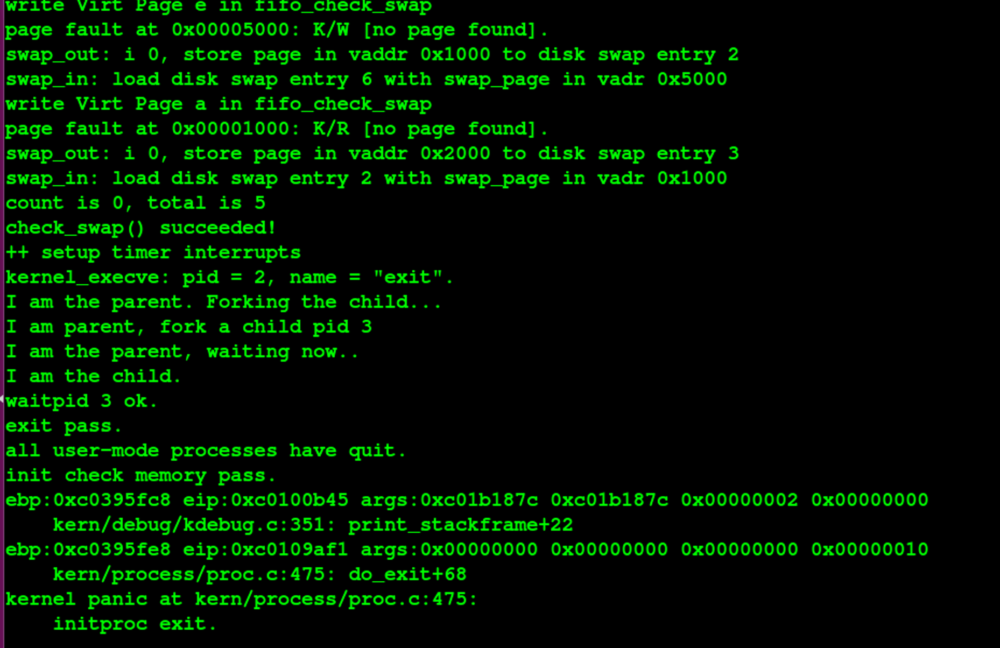
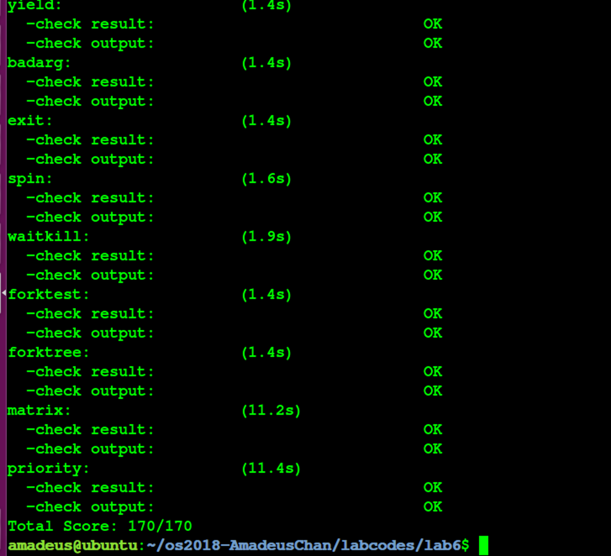

# 操作系统 Lab6 调度器 实验报告


<!-- vim-markdown-toc GFM -->

* [实验目的](#实验目的)
* [实验内容](#实验内容)
* [基本练习](#基本练习)
	* [练习0：填写已有实验](#练习0填写已有实验)
	* [练习1：使用 Round Robin 调度算法（不需要编码）](#练习1使用-round-robin-调度算法不需要编码)
		* [分析](#分析)
		* [问题回答](#问题回答)
	* [练习2：实现 Stride Scheduling 调度算法（需要编码）](#练习2实现-stride-scheduling-调度算法需要编码)
		* [设计实现](#设计实现)
		* [问题回答](#问题回答-1)
	* [实验结果](#实验结果)
* [参考答案分析](#参考答案分析)
* [实验中涉及的知识点列举](#实验中涉及的知识点列举)
* [实验中未涉及的知识点列举](#实验中未涉及的知识点列举)
* [参考文献](#参考文献)

<!-- vim-markdown-toc -->

## 实验目的

- 理解操作系统的调度管理机制;
- 熟悉 ucore 的系统调度器框架，以及缺省的Round-Robin 调度算法;
- 基于调度器框架实现一个(Stride Scheduling)调度算法来替换缺省的调度算法;

## 实验内容

- 熟悉ucore的系统调度器框架，以及基于此框架的Round-Robin（RR）调度算法;
- 然后参考RR调度算法的实现，完成Stride Scheduling调度算法。

## 基本练习

### 练习0：填写已有实验

在本练习中将LAB1/2/3/4/5的实验内容移植到了LAB6的实验框架内，由于手动进行内容移植比较烦杂，因此考虑使用diff和patch工具进行自动化的移植，具体使用的命令如下所示：（对于patch工具进行合并的时候产生冲突的少部分内容，则使用\*.rej, \*.orig文件来手动解决冲突问题）

```
diff -r -u -P lab5_origin lab5 > lab5.patch
cd lab6
patch -p1 -u < ../lab5.patch
```

### 练习1：使用 Round Robin 调度算法（不需要编码）

完成练习0后，建议大家比较一下（可用kdiff3等文件比较软件）个人完成的lab5和练习0完成后的刚修改的lab6之间的区别，分析了解lab6采用RR调度算法后的执行过程。

#### 分析

- 首先使用diff工具对lab5和lab进行比较，发现主要的区别有：
	- PCT中增加了三个与stride调度算法相关的成员变量，以及增加了对应的初始化过程；
	- 新增了斜堆数据结构的实现；
	- 新增了默认的调度算法Round Robin的实现，具体为调用sched_class\_\*等一系列函数之后，进一步调用调度器sched_class中封装的函数，默认该调度器为Round Robin调度器，这是在default_sched.\*中定义的；
	- 新增了set_priority，get_time的系统调用；
- 接下来进行更加具体的代码分析，由于调度算法被封装成了特定的若干个函数，因此只需要追踪这些函数的调用链就可以知道在lab6中具体是如何执行调度算法的：
	- init函数：这个函数被封装为sched_init函数，用于调度算法的初始化，使用grep命令可以知道，该函数仅在ucore入口的init.c里面被调用进行初始化；
	- enqueue函数：该函数的功能为将指定的进程的状态置成RUNNABLE，并且放入调用算法中的可执行队列中，被封装成sched_class_enqueue函数，可以发现这个函数仅在wakeup_proc和schedule函数中被调用，前者为将某个不是RUNNABLE的进程加入可执行队列，而后者是将正在执行的进程换出到可执行队列中去；
	- dequeue函数：该函数的功能为将某个在队列中的进程取出，其封装函数sched_class_dequeue仅在schedule中被调用，表示将调度算法选择的进程从等待的可执行的进程队列中取出进行执行；
	- pick_next函数：该函数的封装函数同样仅在schedule中被调用，功能为选择要执行的下个进程；
	- proc_tick函数：该函数表示每次时钟中断的时候应当调用的调度算法的功能，仅在进行时间中断的ISR中调用；
- 由上述分析可以知道，除了初始化和proc_tick之外，其他调度算法的逻辑都是在schedule和wakeup_proc这两个函数中被调用的，而这两个函数的功能分别为将当前进程切换出去，选择新的可执行的进程来占用CPU，以及将某一个其他状态的进程放入可执行进程的队列中；也就是说在ucore中，一旦需要唤醒某一个进程、或者进行进程间的切换，都会调用者两个函数，进一步调用调度器来完成进程之间调度的管理；

#### 问题回答

- 请理解并分析sched_calss中各个函数指针的用法，并接合Round Robin 调度算法描述ucore的调度执行过程;

	- sched_class中各个函数指针的用法已经在上文中描述过了，此处不再赘述；
	- 接下来结合具体算法描述ucore调度执行过程：
		- 正如前文中所提及到的那样，在ucore中调用调度器的主体函数（不包括init，proc_tick）的代码仅存在在wakeup_proc和schedule，前者的作用在于将某一个指定进程放入可执行进程队列中，后者在于将当前执行的进程放入可执行队列中，然后将队列中选择的下一个执行的进程取出执行；
		- 当需要将某一个进程加入就绪进程队列中，则需要将这个进程的能够使用的时间片进行初始化，然后将其插入到使用链表组织的队列的对尾；这就是具体的Round-Robin enqueue函数的实现；
		- 当需要将某一个进程从就绪队列中取出的时候，只需要将其直接删除即可；
		- 当需要取出执行的下一个进程的时候，只需要将就绪队列的队头取出即可；
		- 每当出现一个时钟中断，则会将当前执行的进程的剩余可执行时间减1，一旦减到了0，则将其标记为可以被调度的，这样在ISR中的后续部分就会调用schedule函数将这个进程切换出去；

- 请在实验报告中简要说明如何设计实现”多级反馈队列调度算法“，给出概要设计，鼓励给出详细设计;
	- 在proc_struct中添加总共N个多级反馈队列的入口，每个队列都有着各自的优先级，编号越大的队列优先级约低，并且优先级越低的队列上时间片的长度越大，为其上一个优先级队列的两倍；并且在PCB中记录当前进程所处的队列的优先级；
	- 处理调度算法初始化的时候需要同时对N个队列进行初始化；
	- 在处理将进程加入到就绪进程集合的时候，观察这个进程的时间片有没有使用完，如果使用完了，就将所在队列的优先级调低，加入到优先级低1级的队列中去，如果没有使用完时间片，则加入到当前优先级的队列中去；
	- 在同一个优先级的队列内使用时间片轮转算法；
	- 在选择下一个执行的进程的时候，有限考虑高优先级的队列中是否存在任务，如果不存在才转而寻找较低优先级的队列；（有可能导致饥饿）
	- 从就绪进程集合中删除某一个进程就只需要在对应队列中删除即可；
	- 处理时间中断的函数不需要改变；
	- 至此完成了多级反馈队列调度算法的具体设计；

### 练习2：实现 Stride Scheduling 调度算法（需要编码）

首先需要换掉RR调度器的实现，即用default_sched_stride_c覆盖default_sched.c。然后根据 此文件和后续文档对Stride度器的相关描述，完成Stride调度算法的实现。

#### 设计实现

- 由于在ucore中使用面向对象编程的思想，将所有与调度算法相关的函数封装在了调度器sched_class中，因此其实可以不需要覆盖掉default_sched.c，只需要将default_sched_stride_c改名成default_sched_stride.c，然后注释掉default_sched.c中的sched_class的定义，这样由于default_sched_stride.c中也有sched_class的定义，其他代码在调用调度器的接口的时候就直接调用了新实现的Stride Scheduling算法实现的函数了；
- 接下来就不妨结合具体代码来讨论stride调度算法的设计实现：
	- 在完成编码任务前，需要对先前LAB所完成的代码进行更新，完成PCB的初始化等工作，由于过于琐碎，此处不再赘述；值得一提的是，需要在时钟中断的处理部分删去print_ticks函数，否则在执行grade脚本的时候，执行到该函数处便会直接panic退出执行；
	- stride_init: 进行调度算法初始化的函数，在本stride调度算法的实现中使用了斜堆来实现优先队列，因此需要对相应的成员变量进行初始化；
	```c
	list_init(&rq->run_list); 
	rq->lab6_run_pool = NULL; // 对斜堆进行初始化，表示有限队列为空
	rq->proc_num = 0;
	```
	- stride_enqeue: 在将指定进程加入就绪队列的时候，需要调用斜堆的插入函数将其插入到斜堆中，然后对时间片等信息进行更新；
	```c
	rq->lab6_run_pool = skew_heap_insert(rq->lab6_run_pool, &proc->lab6_run_pool, proc_stride_comp_f); // 将新的进程插入到表示就绪队列的斜堆中，该函数的返回结果是斜堆的新的根
	if (proc->time_slice == 0 || proc->time_slice > rq->max_time_slice) {
		proc->time_slice = rq->max_time_slice; // 将该进程剩余时间置为时间片大小
	}
	proc->rq = rq; // 更新进程的就绪队列
	rq->proc_num ++; // 维护就绪队列中进程的数量
	```
	- stride_dequeue：将指定进程从就绪队列中删除，只需要将该进程从斜堆中删除掉即可
	```c
	rq->lab6_run_pool = skew_heap_remove(rq->lab6_run_pool, &proc->lab6_run_pool, proc_stride_comp_f); // 删除斜堆中的指定进程
	rq->proc_num --; // 维护就绪队列中的进程总数
	```
	- stride_pick_next: 选择下一个要执行的进程，根据stride算法，只需要选择stride值最小的进程，即斜堆的根节点对应的进程即可：
	```c
	if (rq->lab6_run_pool == NULL) return NULL; 
	struct proc_struct *p = le2proc(rq->lab6_run_pool, lab6_run_pool); // 选择stride值最小的进程
	p->lab6_stride += BIG_STRIDE / p->lab6_priority; // 更新该进程的stride值
	return p;
	```
	- stride_proc_tick：每次时钟中断需要调用的函数，与RR算法中的实现没有区别，不再赘述；

- 至此完成了stride调度算法的具体实现；

#### 问题回答

- 如何证明STRIDE_MAX – STRIDE_MIN <= PASS_MAX？
	- 假如该命题不成立，则可以知道就绪队列在上一次找出用于执行的进程的时候，假如选择的进程是P，那么存在另外一个就绪的进程P'，并且有P'的stride比P严格地小，这也就说明上一次调度出了问题，这和stride算法的设计是相违背的；因此通过反证法证明了上述命题的成立；
- 在 ucore 中，目前Stride是采用无符号的32位整数表示。则BigStride应该取多少，才能保证比较的正确性？
	- 需要保证BigStride<2^32-1；

### 实验结果

最终的实验结果符合预期，并且能够通过make grade脚本的检查，如下图所示：





## 参考答案分析

接下对参考答案的实现与本实验中的实现进行比较分析：

- 关于更新先前LAB的代码的实现部分，发现参考答案在处理时间中断的时候没有调用sched_class_proc_tick函数，这显然是一个错误；
- 接下来比较参考答案的stride算法的实现，发现参考答案同时实现了使用链表和使用斜堆完成就绪队列的stride算法，而在本实验的实现中，仅仅采用了时间效率更高的斜堆实现；在具体使用斜堆实现stride算法部分，几乎没有太大的区别，但是参考答案选取的BigStride恰好是能够选取的最大值2^31-1，而本实现中直接使用了自己的学号作为BigStride的取值；

## 实验中涉及的知识点列举

- 在本次实验中涉及到的知识点如下：
	- 面向对象编程思想；
	- Round-Robin调度算法；
	- Stride调度算法；
	- 多级反馈队列调度算法；
	- 调度算法框架的实现；

- 对应的OS中的知识点如下：
	- ucore中对调度算法的具体封装方式；
	- ucore中具体的三种调度算法的实现；

- 它们之间的关系为：
	- 前者的抽象的算法之后为后者具体的功能是实现提供了基础；
	- 前者中的面向对象等知识有利于简化后者的具体实现过程；

## 实验中未涉及的知识点列举

在本次实验中未涉及到的知识点列举如下： 
- 操作系统的启动过程；
- 具体各种不同的调度算法之间的理论分析对比以及实验分析对比；
- 进程之间的同步互斥机制；

## 参考文献
- https://blog.csdn.net/eaglewood2005/article/details/4377875
- https://baike.baidu.com/item/多级反馈队列调度算法
