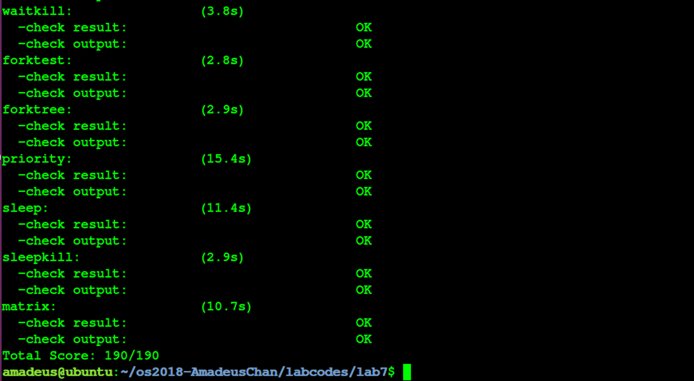

# 操作系统 Lab7 同步互斥 实验报告


<!-- vim-markdown-toc GFM -->

* [实验目的](#实验目的)
* [实验内容](#实验内容)
* [基本练习](#基本练习)
	* [练习0：填写已有实验](#练习0填写已有实验)
	* [练习1：理解内核级信号量的实现和基于内核级信号量的哲学家就餐问题（不需要编码）](#练习1理解内核级信号量的实现和基于内核级信号量的哲学家就餐问题不需要编码)
		* [分析](#分析)
		* [问题回答](#问题回答)
	* [练习2: 完成内核级条件变量和基于内核级条件变量的哲学家就餐问题（需要编码）](#练习2-完成内核级条件变量和基于内核级条件变量的哲学家就餐问题需要编码)
		* [设计实现](#设计实现)
		* [问题回答](#问题回答-1)
	* [实验结果](#实验结果)
* [参考答案分析](#参考答案分析)
* [实验中涉及的知识点列举](#实验中涉及的知识点列举)
* [实验中未涉及的知识点列举](#实验中未涉及的知识点列举)
* [参考文献](#参考文献)

<!-- vim-markdown-toc -->

## 实验目的

- 理解操作系统的同步互斥的设计实现；
- 理解底层支撑技术：禁用中断、定时器、等待队列；
- 在ucore中理解信号量（semaphore）机制的具体实现；
- 理解管程机制，在ucore内核中增加基于管程（monitor）的条件变量（condition variable）的支持；
- 了解经典进程同步问题，并能使用同步机制解决进程同步问题。

## 实验内容

- 主要是熟悉 ucore的进程同步机制—信号量（semaphore）机制，以及基于信号量的哲学家就餐问题解决方案;
- 掌握管程的概念和原理，并参考信号量机制，实现基于管程的条件变量机制和基于条件变量来解决哲学家就餐问题;

## 基本练习

### 练习0：填写已有实验

在本练习中将LAB1/2/3/4/5/6的实验内容移植到了LAB7的实验框架内，由于手动进行内容移植比较烦杂，因此考虑使用diff和patch工具进行自动化的移植，具体使用的命令如下所示：（对于patch工具进行合并的时候产生冲突的少部分内容，则使用\*.rej, \*.orig文件来手动解决冲突问题）

```
diff -r -u -P lab6_origin lab6 > lab6.patch
cd lab7
patch -p1 -u < ../lab6.patch
```

### 练习1：理解内核级信号量的实现和基于内核级信号量的哲学家就餐问题（不需要编码）

#### 分析

- 在进行练习1之前需要对先前LAB中编码的内容进行更新，主要更新为在处理时钟中断的时候，将sched_class_proc_tick函数修改为run_timer_list函数（由于后者中已经包括了前者），用于支持定时器机制;

- 在完成先前实验的代码的更新之后，就能够完成基于信号量的哲学家就餐问题了，因此不妨先查看分析内核级信号量的实现：
	- 实现了内核级信号量机制的函数均定义在sem.c中，因此不妨对这些函数进行分析：
		- sem_init: 对信号量进行初始化的函数，根据在原理课上学习到的内容，信号量包括了等待队列和一个整型数值变量，该函数只需要将该变量设置为指定的初始值，并且将等待队列初始化即可；
		- __up: 对应到了原理课中提及到的V操作，表示释放了一个该信号量对应的资源，如果有等待在了这个信号量上的进程，则将其唤醒执行；结合函数的具体实现可以看到其采用了禁用中断的方式来保证操作的原子性，函数中操作的具体流程为：
			- 查询等待队列是否为空，如果是空的话，给整型变量加1；
			- 如果等待队列非空，取出其中的一个进程唤醒；
		- __down: 同样对应到了原理课中提及的P操作，表示请求一个该信号量对应的资源，同样采用了禁用中断的方式来保证原子性，具体流程为：
			- 查询整型变量来了解是否存在多余的可分配的资源，是的话取出资源（整型变量减1），之后当前进程便可以正常进行；
			- 如果没有可用的资源，整型变量不是正数，当前进程的资源需求得不到满足，因此将其状态改为SLEEPING态，然后将其挂到对应信号量的等待队列中，调用schedule函数来让出CPU，在资源得到满足，重新被唤醒之后，将自身从等待队列上删除掉；
		- up, down：对__up, __down函数的简单封装；
		- try_down: 不进入等待队列的P操作，即时是获取资源失败也不会堵塞当前进程；

#### 问题回答

- 请在实验报告中给出给用户态进程/线程提供信号量机制的设计方案，并比较说明给内核级提供信号量机制的异同。
	- 将内核信号量机制迁移到用户态的最大麻烦在于，用于保证操作原子性的禁用中断机制、以及CPU提供的Test and Set指令机制都只能在用户态下运行，而使用软件方法的同步互斥又相当复杂，这就使得没法在用户态下直接实现信号量机制；于是，为了方便起见，可以将信号量机制的实现放在OS中来提供，然后使用系统调用的方法统一提供出若干个管理信号量的系统调用，分别如下所示：
		- 申请创建一个信号量的系统调用，可以指定初始值，返回一个信号量描述符(类似文件描述符)；
		- 将指定信号量执行P操作；
		- 将指定信号量执行V操作；
		- 将指定信号量释放掉；
	- 给内核级线程提供信号量机制和给用户态进程/线程提供信号量机制的异同点在于：
		- 相同点：
			- 提供信号量机制的代码实现逻辑是相同的；
		- 不同点：
			- 由于实现原子操作的中断禁用、Test and Set指令等均需要在内核态下运行，因此提供给用户态进程的信号量机制是通过系统调用来实现的，而内核级线程只需要直接调用相应的函数就可以了；

### 练习2: 完成内核级条件变量和基于内核级条件变量的哲学家就餐问题（需要编码）

首先掌握管程机制，然后基于信号量实现完成条件变量实现，然后用管程机制实现哲学家就餐问题的解决方案（基于条件变量）。

#### 设计实现

- 接下来分析本实验中内核级条件变量机制的实现：
	- 关于条件变量机制的实现主要位于monitor.c文件中的cond_signal, cond_wait两个函数中，这两个函数的含义分别表示提醒等待在这个条件变量上的进程恢复执行，以及等待在这个条件变量上，直到有其他进行将其唤醒位置；下文将对这两个函数的具体实现进行分析：
		- cond_signal: 将指定条件变量上等待队列中的一个线程进行唤醒，并且将控制权转交给这个进程；具体执行流程为：
			- 判断当前的条件变量的等待队列上是否有正在等待的进程，如果没有则不需要进行任何操作；
			- 如果由正在等待的进程，则将其中的一个唤醒，这里的等待队列是使用了一个信号量来进行实现的，由于信号量中已经包括了对等待队列的操作，因此要进行唤醒只需要对信号量执行up操作即可；
			- 接下来当前进程为了将控制权转交给被唤醒的进程，将自己等待到了这个条件变量所述的管程的next信号量上，这样的话就可以切换到被唤醒的进程了；由于next信号量的实现，就带来了两个困惑：
				- 等待在next信号量上的进程是否能够被唤醒？由于每一个next信号量上等待的进程的产生必定是因为存在了某个它需要唤醒的进程，而这个进程在结束cond_wait函数之后返回到管程的函数，还会检查next信号量上是否存在等待着的进程，有的话将其唤醒，因此每一个next信号量上等待的进程最终必定会被唤醒；
				- 在等待在next信号量上的时候，管程的mutex锁并没有被释放，是否可能存在该锁永远都被释放不了的情况？不会的。根据前一个问题得知所有next信号量上的等待进程一定会被唤醒，那么最后一个被唤醒的next进程就会将锁释放掉；
				- 最终的具体代码实现如下所示：
					```c
					if (cvp->count > 0) { // 判断条件变量的等待队列是否为空
						cvp->owner->next_count ++; // 修改next变量上等待进程计数，跟下一个语句不能交换位置，为了得到互斥访问的效果，关键在于访问共享变量的时候，管程中是否只有一个进程处于RUNNABLE的状态
						up(&cvp->sem); // 唤醒等待队列中的某一个进程
						down(&cvp->owner->next); // 把自己等待在next条件变量上
						cvp->owner->next_count --; // 当前进程被唤醒，恢复next上的等待进程计数
					}
					```
			- 接下来，当前进程被从next信号量上被唤醒的时候，首先将next count减一，然后离开cond_signal函数，回到管程中的函数，检查是否应该释放管程的锁（取决于现在是否还有next信号量上等待的进程，有的话将其唤醒，完成其在函数中的操作，并且将释放锁的操作延迟给这个进程来进行），根据上述描述，我们可以知道在管程中能够运行的进程之间不会有互相有意料外的打断的过程（由于进程的切换时机都是固定好的，由当前的进程来唤醒另外某一个进程），因此实现了对共享变量访问的互斥性；
		- cond_wait: 该函数的功能为将当前进程等待在指定信号量上，其操作过程为将等待队列的计数加1，然后释放管程的锁或者唤醒一个next上的进程来释放锁（否则会造成管程被锁死无法继续访问，同时这个操作不能和前面的等待队列计数加1的操作互换顺序，要不不能保证共享变量访问的互斥性），然后把自己等在条件变量的等待队列上，直到有signal信号将其唤醒，正常退出函数；
			- 最终具体的代码实现如下所示：
			```c
			cvp->count ++; // 修改等待在条件变量的等待队列上的进程计数
			if (cvp->owner->next_count > 0) { // 释放锁
				up(&cvp->owner->next);
			} else {
				up(&cvp->owner->mutex);
			}
			down(&cvp->sem); // 将自己等待在条件变量上
			cvp->count --; // 被唤醒，修正等待队列上的进程计数
			```

- 接下来分析本实验中基于条件变量和管程的哲学家就餐问题的实现:
	- 关于使用条件变量来完成哲学家就餐问题的实现中，总共有两个关键函数，以及使用到了N（哲学家数量）个条件变量，在管程中，还包括了一个限制管程访问的锁还有N个用于描述哲学家状态的变量（总共有EATING, THINKING, HUNGER）三种状态；
		- 首先分析phi_take_forks_condvar函数的实现，该函数表示指定的哲学家尝试获得自己所需要进餐的两把叉子，如果不能获得则阻塞，具体实现流程为：
			- 给管程上锁；
			- 将哲学家的状态修改为HUNGER；
			- 判断当前哲学家是否有足够的资源进行就餐（相邻的哲学家是否正在进餐）；
			- 如果能够进餐，将自己的状态修改成EATING，然后释放锁，离开管程即可；
			- 如果不能进餐，等待在自己对应的条件变量上，等待相邻的哲学家释放资源的时候将自己唤醒；
			- 最终具体的代码实现如下：
			```c
			down(&(mtp->mutex)); // 获取管程的锁
			state_condvar[i] = HUNGRY; // 将自己设置为饥饿
			if (state_condvar[(i + 4) % 5] != EATING && state_condvar[(i + 1) % 5] != EATING) { // 判断当前叉子是否足够就餐
				state_condvar[i] = EATING; // 就餐
			} else {
				cprintf("phi_take_forks_condvar: %d didn’t get fork and will wait\n", i);
				cond_wait(mtp->cv + i); // 等待其他人释放资源
			}
			if(mtp->next_count>0) // 释放管程的锁
				up(&(mtp->next));
			else
				up(&(mtp->mutex));
			```
		- 而phi_put_forks_condvar函数则是释放当前哲学家占用的叉子，并且唤醒相邻的因为得不到资源而进入等待的哲学家：
			- 首先获取管程的锁；
			- 将自己的状态修改成THINKING；
			- 检查相邻的哲学家是否在自己释放了叉子的占用之后满足了进餐的条件，如果满足，将其从等待中唤醒（使用cond_signal）；
			- 释放锁，离开管程；
			- 最终的具体代码实现如下：
			```c
			down(&(mtp->mutex)); // 获取管程的锁
			state_condvar[i] = THINKING; // 停止就餐
			cprintf("phi_put_forks_condvar: %d finished eating\n", i); // 由于LAB7的评测脚本较弱，这是为了验证访问的互斥性而额外添加的注释性输出，可以用于my_spj.py（本实验中额外完成的评测脚本）的测试
			phi_test_condvar((i + N - 1) % N); // 判断左右邻居的哲学家是否可以从等待就餐的状态中恢复过来
			phi_test_condvar((i + 1) % N);
			if(mtp->next_count>0)
				up(&(mtp->next));
			else
				up(&(mtp->mutex));
			```
		- 由于限制了管程中在访问共享变量的时候处于RUNNABLE的进程只有一个，因此对进程的访问是互斥的；并且由于每个哲学家只可能占有所有需要的资源（叉子）或者干脆不占用资源，因此不会出现部分占有资源的现象，从而避免了死锁的产生；
		- 根据上述分析，可知最终必定所有哲学将都能成功就餐；

#### 问题回答

- 请在实验报告中给出给用户态进程/线程提供条件变量机制的设计方案，并比较说明给内核级 提供条件变量机制的异同。
	- 发现在本实验中管程的实现中互斥访问的保证是完全基于信号量的，也就是如果按照上文中的说明使用syscall实现了用户态的信号量的实现机制，那么就完全可以按照相同的逻辑在用户态实现管程机制和条件变量机制；
	- 当然也可以仿照用户态实现条件变量的方式，将对访问管程的操作封装成系统调用；
	- 异同点为：
		- 相同点：基本的实现逻辑相同；
		- 不同点：最终在用户态下实现管程和条件变量机制，需要使用到操作系统使用系统调用提供一定的支持; 而在内核态下实现条件变量是不需要的；

- 请在实验报告中回答：能否不用基于信号量机制来完成条件变量？如果不能，请给出理由， 如果能，请给出设计说明和具体实现。
	- 能够基于信号量来完成条件变量机制；
	- 事实上在本实验中就是这么完成的，只需要将使用信号量来实现条件变量和管程中使用的锁和等待队列即可；

### 实验结果

最终的实验结果符合预期，并且能够通过make grade脚本的检查以及检查是否互斥访问资源的本实验中额外完成的检查脚本(my_spj.py, 为了配合该脚本的检查还额外增加了"\*\*\* finished eating"的额外输出)的检查（该检查中出现三个不符合预期是因为这几个测试样例中故意引发了异常，所以被结束掉了，因此看不到关于解决哲学家问题的输出）；实验结果如下图所示：





## 参考答案分析

本实验中的实现与参考答案的主要区别有：
- 参考答案在进行时钟中断ISR时额外判断了当前进程是否指向NULL这一错误；
- 参考答案在实现获取叉子的函数时候直接调用了phi_test_condvar函数实现，本实验中的实现为之间进行条件判断，这是等价的；
- 除此之外，本实验中的实现与参考答案基本一致，这是因为在实现管程的时候，很多操作之间都有着严格的先后要求，否则就会出错，因此最终实现的代码高度一致是很合理的；

## 实验中涉及的知识点列举

- 在本次实验中涉及到的知识点如下：
	- 底层为操作系统实现互斥访问的机制：禁用中断、定时器、等待队列、Test and Set指令等；
	- 信号量机制；
	- 条件变量和管程机制；
	- 解决同步互斥问题的方法；

- 对应的OS中的知识点如下：
	- 在OS中实现对资源互斥访问的方法；
	- 在OS中具体实现信号量机制、条件变量和管程机制的方法；
	- 具体解决同步互斥问题的实现；

- 它们之间的关系为：
	- 前者的知识点为后者提供了底层支持；
	- 前者的知识点为后者的理论基础；

## 实验中未涉及的知识点列举

在本次实验中未涉及到的知识点列举如下： 

- 操作系统的启动过程；
- 操作系统的内存管理；
- 操作系统对I/O设备的管理；

## 参考文献
- http://faculty.salina.k-state.edu/tim/ossg/IPC_sync/ts.html
