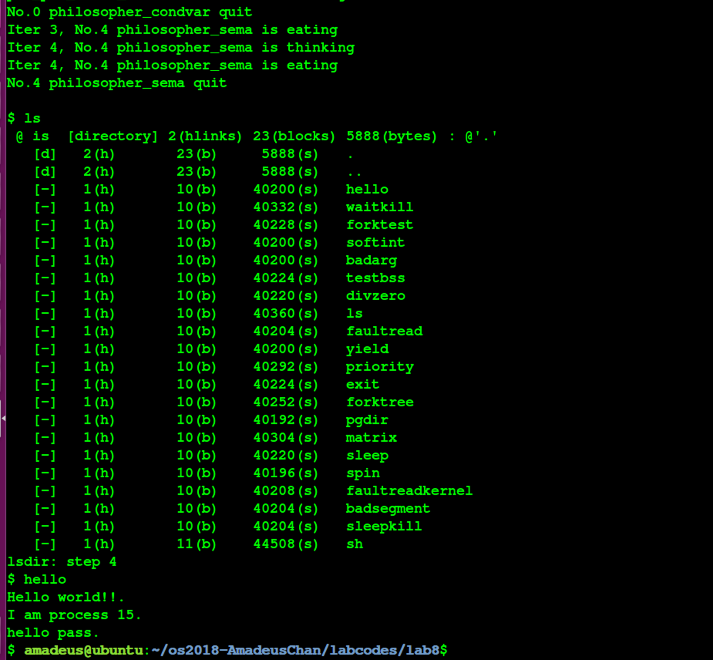
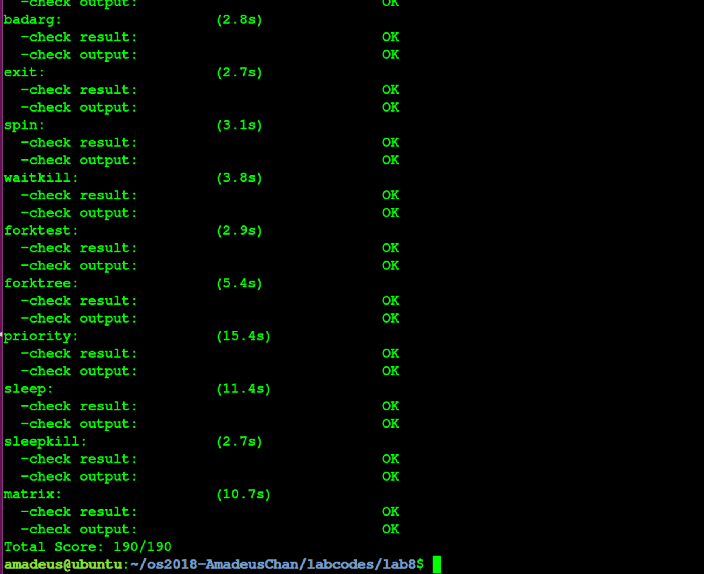

# 操作系统 Lab8 文件系统 实验报告


<!-- vim-markdown-toc GFM -->

* [实验目的](#实验目的)
* [实验内容](#实验内容)
* [基本练习](#基本练习)
	* [练习0：填写已有实验](#练习0填写已有实验)
	* [练习1：完成读文件操作的实现（需要编码）](#练习1完成读文件操作的实现需要编码)
		* [设计实现](#设计实现)
		* [问题回答](#问题回答)
	* [练习2: 完成基于文件系统的执行程序机制的实现（需要编码）](#练习2-完成基于文件系统的执行程序机制的实现需要编码)
		* [设计实现](#设计实现-1)
		* [问题回答](#问题回答-1)
	* [实验结果](#实验结果)
* [参考答案分析](#参考答案分析)
	* [练习1](#练习1)
	* [练习2](#练习2)
* [实验中涉及的知识点列举](#实验中涉及的知识点列举)
* [实验中未涉及的知识点列举](#实验中未涉及的知识点列举)
* [参考文献](#参考文献)

<!-- vim-markdown-toc -->

## 实验目的

- 了解基本的文件系统系统调用的实现方法；
- 了解一个基于索引节点组织方式的Simple FS文件系统的设计与实现；
- 了解文件系统抽象层-VFS的设计与实现；

## 实验内容

- 通过分析了解ucore文件系统的总体架构设计，完善读写文件操作;
- 实现基于文件系统的执行程序机制（即改写do_execve），从而可以完成执行存储在磁盘上的文件和实现文件读写等功能;

## 基本练习

### 练习0：填写已有实验

在本练习中将LAB1/2/3/4/5/6/7的实验内容移植到了LAB8的实验框架内，由于手动进行内容移植比较烦杂，因此考虑使用diff和patch工具进行自动化的移植，具体使用的命令如下所示：（对于patch工具进行合并的时候产生冲突的少部分内容，则使用\*.rej, \*.orig文件来手动解决冲突问题）

```
diff -r -u -P lab7_origin lab7 > lab7.patch
cd lab8
patch -p1 -u < ../lab7.patch
```

### 练习1：完成读文件操作的实现（需要编码）

首先了解打开文件的处理流程，然后参考本实验后续的文件读写操作的过程分析，编写在sfs_inode.c中sfs_io_nolock读文件中数据的实现代码。

#### 设计实现

- 在完成练习1之前，首先需要对先前LAB中填写的代码进行更新，包括对进程控制块中新增变量的初始化、以及在do_fork等函数中对这些变量进行相应的设置等，由于这些内容均比较琐碎，因此在本报告中将不对其进行赘述；
- 在本练习中需要进行具体编码实现的函数是sfs_node.c文件中的sfs_io_nolock函数，因此不妨对该函数进行分析：
	- 根据对该函数的观察可以得知，该函数的功能为针对指定的文件（文件对应的内存中的inode信息已经给出），从指定偏移量进行指定长度的读或者写操作，因此不妨分析系统调用的读操作究竟是符合调用到这个函数的来了解这个函数在整个系统中的功能：
		- 发起read系统调用后，通过正常的系统调用处理流程，进入sys_read函数，该函数进一步调用了sysfile_read函数，在这个函数中，创建了大小有限的缓冲区，用于从文件读取数据之后，进一步复制到用户空间的指定位置去；具体用于从文件读取数据的函数是file_read，在file_read函数中，通过文件描述符查找到了相应文件对应的内存中的inode信息，然后转交给vop_read进行读取处理，事实上就是转交到了sfs_read函数进行处理（通过函数指针），然后调用了sfs_io函数，再进一步调用了sfs_io_nolock函数，这就是我们在本次练习中需要完善的函数；
		- 在sfs_io_nolock函数中，首先会进行一系列边界检查，检查是否访问合法，然后将具体的读/写操作使用函数指针统一起来，统一成针对整块的操作，以及不需要针对整块的操作两个处理函数，接下来的部分就是在本次实验中需要完成的部分了，这部分的主要功能为完成不落在整块数据块上的读/写操作，以及落在整块数据块上的读写，接下来将结合具体的代码来说明实际的实现过程：
		```c
		if (offset % SFS_BLKSIZE != 0 || endpos / SFS_BLKSIZE == offset / SFS_BLKSIZE) { // 判断被需要读/写的区域所覆盖的数据块中的第一块是否是完全被覆盖的，如果不是，则需要调用非整块数据块进行读或写的函数来完成相应操作
		        blkoff = offset % SFS_BLKSIZE; // 计算出在第一块数据块中进行读或写操作的偏移量
		        size = (nblks != 0) ? (SFS_BLKSIZE - blkoff) : (endpos - offset); // 计算出在第一块数据块中进行读或写操作需要的数据长度
		        if ((ret = sfs_bmap_load_nolock(sfs, sin, blkno, &ino)) != 0) goto out; // 获取当前这个数据块对应到的磁盘上的数据块的编号
		        if ((ret = sfs_buf_op(sfs, buf, size, ino, blkoff)) != 0) goto out; // 将数据写入到磁盘中
		        alen += size; // 维护已经读写成功的数据长度信息
		        buf += size;
		}
		uint32_t my_nblks = nblks;
		if (offset % SFS_BLKSIZE != 0 && my_nblks > 0) my_nblks --;
		if (my_nblks > 0) { // 判断是否存在被需要读写的区域完全覆盖的数据块
		        if ((ret = sfs_bmap_load_nolock(sfs, sin, (offset % SFS_BLKSIZE == 0) ? blkno: blkno + 1, &ino)) != 0) goto out; // 如果存在，首先获取这些数据块对应到磁盘上的数据块的编号
		        if ((ret = sfs_block_op(sfs, buf, ino, my_nblks)) != 0) goto out; // 将这些磁盘上的这些数据块进行读或写操作
		        size = SFS_BLKSIZE * my_nblks;
		        alen += size; // 维护已经成功读写的数据长度
		        buf += size; // 维护缓冲区的偏移量
		}
		if (endpos % SFS_BLKSIZE != 0 && endpos / SFS_BLKSIZE != offset / SFS_BLKSIZE) { // 判断需要读写的最后一个数据块是否被完全覆盖（这里还需要确保这个数据块不是第一块数据块，因为第一块数据块已经操作过了）
		        size = endpos % SFS_BLKSIZE; // 确定在这数据块中需要读写的长度
		        if ((ret = sfs_bmap_load_nolock(sfs, sin, endpos / SFS_BLKSIZE, &ino) == 0) != 0) goto out; // 获取该数据块对应到磁盘上的数据块的编号
		        if ((ret = sfs_buf_op(sfs, buf, size, ino, 0)) != 0) goto out; // 进行非整块的读或者写操作
		        alen += size;
		        buf += size;
		}
		```
		- 至此，练习1中的所有编码工作完成，实现了读文件操作；

#### 问题回答

- 请在实验报告中给出设计实现”UNIX的PIPE机制“的概要设方案，鼓励给出详细设计方案。
	- 为了实现UNIX的PIPE机制，可以考虑在磁盘上保留一部分空间或者是一个特定的文件来作为pipe机制的缓冲区，接下来将说明如何完成对pipe机制的支持：
		- 当某两个进程之间要求建立管道，假定将进程A的标准输出作为进程B的标准输入，那么可以在这两个进程的进程控制块上新增变量来记录进程的这种属性；并且同时生成一个临时的文件，并将其在进程A, B中打开;
		- 当进程A使用标准输出进行write系统调用的时候，通过PCB中的变量可以知道，需要将这些标准输出的数据输出到先前提高的临时文件中去；
		- 当进程B使用标准输入的时候进行read系统调用的时候，根据其PCB中的信息可以知道，需要从上述的临时文件中读取数据；
		- 至此完成了对pipe机制的设计；
	- 事实上，由于在真实的文件系统和用户之间还由一层虚拟文件系统，因此我们也可以不把数据缓冲在磁盘上，而是直接保存在内存中，然后完成一个根据虚拟文件系统的规范完成一个虚拟的pipe文件，然后进行输入输出的时候只要对这个文件进行操作即可；

### 练习2: 完成基于文件系统的执行程序机制的实现（需要编码）

改写proc.c中的load_icode函数和其他相关函数，实现基于文件系统的执行程序机制。执行： make qemu。如果能看看到sh用户程序的执行界面，则基本成功了。如果在sh用户界面上可 以执行”ls”,”hello”等其他放置在sfs文件系统中的其他执行程序，则可以认为本实验基本成功。

#### 设计实现

- 通过对实验代码的分析可以得知最终用于从磁盘上读取可执行文件，并且加载到内存中，完成内存空间的初始化的函数是load_icode函数，该函数在本LAB中的具体实现与先前的LAB区别在于，先前的LAB仅仅将原先就加载到了内核内存空间中的ELF可执行文件加载到用户内存空间中，而没有涉及从磁盘读取数据的操作，而且先前的时候也没有考虑到给需要执行的应用程度传递操作的可能性；
- 仿照先前lab中的load_icode实现，可以大致将该函数的实现流程分为以下几个步骤：
	- 给要执行的用户进程创建一个新的内存管理结构mm，原先该进程的mm已经在do_execve中被释放掉了；
	- 创建用户内存空间的新的页目录表；
	- 将磁盘上的ELF文件的TEXT/DATA/BSS段正确地加载到用户空间中；
		- 从磁盘中读取elf文件的header；
		- 根据elfheader中的信息，获取到磁盘上的program header；
		- 对于每一个program header:
			- 为TEXT/DATA段在用户内存空间上的保存分配物理内存页，同时建立物理页和虚拟页的映射关系；
			- 从磁盘上读取TEXT/DATA段，并且复制到用户内存空间上去；
			- 根据program header得知是否需要创建BBS段，如果是，则分配相应的内存空间，并且全部初始化成0，并且建立物理页和虚拟页的映射关系；
	- 将用户栈的虚拟空间设置为合法，并且为栈顶部分先分配4个物理页，建立好映射关系；
	- 切换到用户地址空间；
	- 设置好用户栈上的信息，即需要传递给执行程序的参数；
	- 设置好中断帧；
- 接下来结合具体的代码实现来说明本实验中的实现:
```c
static int
load_icode(int fd, int argc, char **kargv) {
    	if (current->mm != NULL) { // 判断当前进程的mm是否已经被释放掉了
    	    panic("load_icode: current->mm must be empty.\n");
    	}

	int ret = -E_NO_MEM;
	struct mm_struct *mm;

	// (1) create a new mm for current process
	if ((mm = mm_create()) == NULL) { // 为进程创建一个新的mm
		goto bad_mm;
	}
	// (2) create a new PDT
	if ((ret = setup_pgdir(mm)) != 0) { // 进行页表项的设置
		goto bad_pgdir_cleanup_mm;
	}
	// (3) copy TEXT/DATA/BSS section 
	// (3.1) resolve elf header
	struct elfhdr elf, *elfp = &elf;
	off_t offset = 0;
	load_icode_read(fd, (void *) elfp, sizeof(struct elfhdr), offset); // 从磁盘上读取出ELF可执行文件的elf-header
	offset += sizeof(struct elfhdr);
	if (elfp->e_magic != ELF_MAGIC) { // 判断该ELF文件是否合法
		ret = -E_INVAL_ELF;
		goto bad_elf_cleanup_pgdir;
	}

	struct proghdr ph, *php = &ph;
	uint32_t vm_flags, perm;
	struct Page *page;
	for (int i = 0; i < elfp->e_phnum; ++ i) { // 根据elf-header中的信息，找到每一个program header
		// (3.2) resolve prog header
		load_icode_read(fd, (void *) php, sizeof(struct proghdr), elfp->e_phoff + i * sizeof(struct proghdr)); // 读取program header
		if (php->p_type != ELF_PT_LOAD) {
			continue;
		}
		if (php->p_filesz > php->p_memsz) { 
			ret = -E_INVAL_ELF;
			goto bad_cleanup_mmap;
		}
		if (php->p_filesz == 0) {
			continue;
		}
		// (3.3) build vma
		vm_flags = 0, perm = PTE_U;
		if (php->p_flags & ELF_PF_X) vm_flags |= VM_EXEC; // 根据ELF文件中的信息，对各个段的权限进行设置
		if (php->p_flags & ELF_PF_W) vm_flags |= VM_WRITE;
		if (php->p_flags & ELF_PF_R) vm_flags |= VM_READ;
		if (vm_flags & VM_WRITE) perm |= PTE_W;
		if ((ret = mm_map(mm, php->p_va, php->p_memsz, vm_flags, NULL)) != 0) { // 将这些段的虚拟内存地址设置为合法的
			goto bad_cleanup_mmap;
		}
		// (3.4) allocate pages for TEXT/DATA sections
		offset = php->p_offset;
		size_t off, size;
		uintptr_t start = php->p_va, end = php->p_va + php->p_filesz, la = ROUNDDOWN(start, PGSIZE);
		ret = -E_NO_MEM;
		while (start < end) {
			if ((page = pgdir_alloc_page(mm->pgdir, la, perm)) == NULL) { // 为TEXT/DATA段逐页分配物理内存空间
				goto bad_cleanup_mmap;
			}
			off = start - la, size = PGSIZE - off, la += PGSIZE;
			if (end < la) {
				size -= la - end;
			}
			load_icode_read(fd, page2kva(page) + off, size, offset);  // 将磁盘上的TEXT/DATA段读入到分配好的内存空间中去
			//memcpy(page2kva(page) + off, page2kva(buff_page), size);
			start += size, offset += size;
		}

		// (3.5) allocate pages for BSS
		end = php->p_va + php->p_memsz;
		if (start < la) { // 如果存在BSS段，并且先前的TEXT/DATA段分配的最后一页没有被完全占用，则剩余的部分被BSS段占用，因此进行清零初始化
			if (start == end) {
				continue;
			}
			off = start + PGSIZE - la, size = PGSIZE - off;
			if (end < la) {
				size -= la - end;
			}
			memset(page2kva(page) + off, 0, size); // init all BSS data with 0
			start += size;
			assert((end < la && start == end) || (end >= la && start == la));
		}
		while (start < end) {  // 如果BSS段还需要更多的内存空间的话，进一步进行分配
			if ((page = pgdir_alloc_page(mm->pgdir, la, perm)) == NULL) { // 为BSS段分配新的物理内存页
				goto bad_cleanup_mmap;
			}
			off = start - la, size = PGSIZE - off, la += PGSIZE;
			if (end < la) {
				size -= la - end;
			}
			memset(page2kva(page), 0, size); // 将分配到的空间清零初始化
			start += size;
		}

	}
	sysfile_close(fd); // 关闭传入的文件，因为在之后的操作中已经不需要读文件了

	// (4) setup user stack
	vm_flags = VM_READ | VM_WRITE | VM_STACK; // 设置用户栈的权限
	if ((ret = mm_map(mm, USTACKTOP - USTACKSIZE, USTACKSIZE, vm_flags, NULL)) != 0) { // 将用户栈所在的虚拟内存区域设置为合法的
		goto bad_cleanup_mmap;
	}
	// setup args
	uint32_t stacktop = USTACKTOP;
	uint32_t argsize = 0;
	for (int j = 0; j < argc; ++ j) {  // 确定传入给应用程序的参数具体应当占用多少空间
		argsize += (1 + strlen(kargv[j])); // includinng the ending '\0'
	}
	argsize = (argsize / sizeof(long) + 1) * sizeof(long); //alignment
	argsize += (2 + argc) * sizeof(long);  
	stacktop = USTACKTOP - argsize; // 根据参数需要在栈上占用的空间来推算出，传递了参数之后栈顶的位置
	uint32_t pagen = argsize / PGSIZE + 4;
	for (int j = 1; j <= 4; ++ j) { // 首先给栈顶分配四个物理页
		assert(pgdir_alloc_page(mm->pgdir, USTACKTOP - PGSIZE * j, PTE_USER) != NULL);
	} 

	// for convinience, setup mm (5)
	mm_count_inc(mm); // 切换到用户的内存空间，这样的话后文中在栈上设置参数部分的操作将大大简化，因为具体因为空间不足而导致的分配物理页的操作已经交由page fault处理了，是完全透明的
	current->mm = mm;
	current->cr3 = PADDR(mm->pgdir);
	lcr3(PADDR(mm->pgdir));

	// (6) setup args in user stack
	uint32_t now_pos = stacktop, argvp;
	*((uint32_t *) now_pos) = argc; // 设置好argc参数（压入栈）
	now_pos += 4;
	*((uint32_t *) now_pos) = argvp = now_pos + 4; // 设置argv数组的位置
	now_pos += 4;
	now_pos += argc * 4;
	for (int j = 0; j < argc; ++ j) {
		argsize = strlen(kargv[j]) + 1;  // 将argv[j]指向的数据拷贝到用户栈中
		memcpy((void *) now_pos, kargv[j], argsize);
		*((uint32_t *) (argvp + j * 4)) = now_pos; // 设置好用户栈中argv[j]的数值
		now_pos += argsize;
	}

	// (7) setup tf
	struct trapframe *tf = current->tf; // 设置中断帧
	memset(tf, 0, sizeof(struct trapframe));
	tf->tf_cs = USER_CS; // 需要返回到用户态，因此使用用户态的数据段和代码段的选择子
	tf->tf_ds = tf->tf_es = tf->tf_ss = USER_DS;
	tf->tf_esp = stacktop; // 栈顶位置为先前计算过的栈顶位置，注意在C语言的函数调用规范中，栈顶指针指向的位置应该是返回地址而不是第一个参数，这里让栈顶指针指向了第一个参数的原因在于，在中断返回之后，会跳转到ELF可执行程序的入口处，在该入口处会进一步使用call命令调用主函数，这时候也就完成了将Return address入栈的功能，因此这里无需画蛇添足压入返回地址
	tf->tf_eip = elfp->e_entry; // 将返回地址设置为用户程序的入口
	tf->tf_eflags = 0x2 | FL_IF; // 允许中断，根据IA32的规范，eflags的第1位需要恒为1
	ret = 0;
	
out:
	return ret;
bad_cleanup_mmap: // 进行加载失败的一系列清理操作
	exit_mmap(mm);
bad_elf_cleanup_pgdir:
	put_pgdir(mm);
bad_pgdir_cleanup_mm:
	mm_destroy(mm);
bad_mm:
	goto out;

}
```
- 至此，完成了本练习中的所有编码任务；


#### 问题回答

- 请在实验报告中给出设计实现基于”UNIX的硬链接和软链接机制“的概要设方案，鼓励给出详细设计方案;
	- 观察到保存在磁盘上的inode信息均存在一个nlinks变量用于表示当前文件的被链接的计数，因而支持实现硬链接和软链接机制；
		- 如果在磁盘上创建一个文件A的软链接B，那么将B当成正常的文件创建inode，然后将TYPE域设置为链接，然后使用剩余的域中的一个，指向A的inode位置，然后再额外使用一个位来标记当前的链接是软链接还是硬链接；
		- 当访问到文件B（read，write等系统调用），判断如果B是一个链接，则实际是将对B指向的文件A（已经知道了A的inode位置）进行操作；
		- 当删除一个软链接B的时候，直接将其在磁盘上的inode删掉即可；
		- 如果在磁盘上的文件A创建一个硬链接B，那么在按照软链接的方法创建完B之后，还需要将A中的被链接的计数加1；
		- 访问硬链接的方式与访问软链接是一致的；
		- 当删除一个硬链接B的时候，除了需要删除掉B的inode之外，还需要将B指向的文件A的被链接计数减1，如果减到了0，则需要将A删除掉；

### 实验结果

最终的实验结果符合预期，并且能够通过make grade脚本的检查，如下图所示：





## 参考答案分析

### 练习1

比较练习1的实现与参考答案的实现的区别在于一些细节方面的实现，主要体现在对完全被读写区域覆盖的数据块进行读写的时候，提供的函数事实上是可以完成连续若干块数据块的读写的，但是参考答案没有利用这个特点，而是额外添加了一个循环，然后在循环中对每一个数据块逐次进行读取操作，这有可能会造成时间效率的降低；

### 练习2

本实验在练习2中的实现与参考答案的实现大致一致，但是经过仔细的比较，观察到一个细节，参考答案在确定参数的长度的时候使用的函数时strnlen，而本实验中的实现使用了strlen，而后者是不安全的，有可能遭到栈溢出攻击的，因此在这个区别上，参考答案的实现明显优于本实验的实验，这也其实我在完成实际的编程任务的时候需要充分考虑到鲁棒性、安全性等细节，这也是我自己觉得在本次操作系统实验中做得有所欠缺的地方；

## 实验中涉及的知识点列举

- 在本次实验中涉及到的知识点如下：

	- 虚拟文件系统；
	- SFS文件系统；
	- 将设备抽象为文件的管理方式；
	- 系统调用；
	- 进程间的调度、管理；
	- ELF文件格式；
	- ucore中用户进程虚拟空间的划分；

- 对应的OS中的知识点如下：
	
	- 在ucore中文件系统、虚拟文件系统、以及SFS文件系统的具体实现；
	- 在ucore中将stdin，stdout抽象成文件的机制；
	- 在ucore中系统调用的机制；
	- 在ucore中完成ELF文件从磁盘到内存的加载的具体机制；

- 它们之间的关系为：
	
	- 前者为后者提供了底层的支持，比如对SFS文件系统的了解才能够使得可以在OS中正确地实现对使用该文件系统的磁盘的访问；
	- 前者给后者提供了必要的基础知识，比如只有了解了ELF文件的格式，以及了解了用户进程空间的划分之后，才能够正确地在OS中实现将指定ELF文件加载到内存中运行的操作（exec系统调用）；

## 实验中未涉及的知识点列举

在本次实验中未涉及到的知识点列举如下： 

- 进程之间的同步互斥机制；
- 操作系统的启动机制；
- 操作系统对网络协议栈的支持；

## 参考文献
- INTEL 80386 PROGRAMMER'S REFERENCE MANUAL 1986
